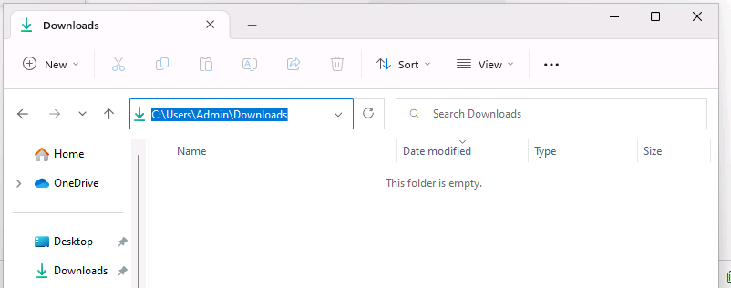
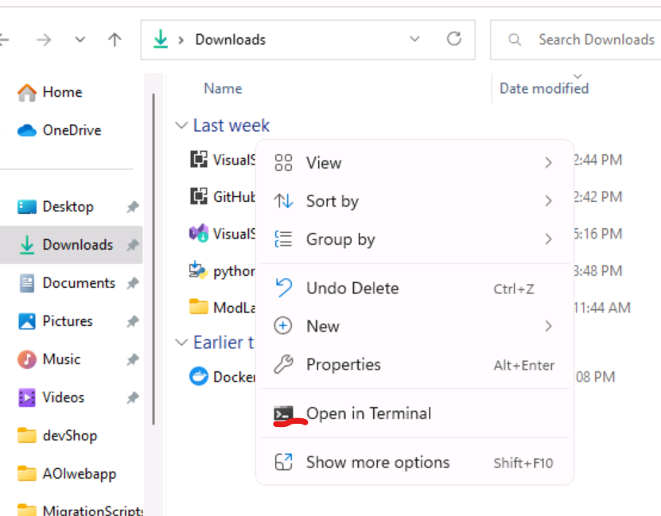

# Task 01 - Clone the GitHub repository for the project to your local machine

<!--- Estimated time: 3 minutes---> 

## Introduction

The Contoso Hotel app is monolithic. Front-end components (HTML, CSS, and JavaScript files) and back-end components (APIs) are all deployed as a single unit. The files required to deploy the legacy app are stored in a GitHub repository. 

Throughout this lab, we will be using PowerShell as our termina. We will begin by opening up powershell, then cloning the required code to our Downloads folder.

## Description

In this task, you’ll clone the GitHub repository to the **Downloads** folder on your local machine.

1.  Open File Explorer on your computer and go to the **Downloads** folder. 

    

1. Right click twice in any empty space within the Downloads folder window that isnt a file to open up the menu. The second time you right click on this empty space, you should see **Open in Terminal** as an option. Click on **Open in Terminal**
    
Make sure your terminal is PowerShell. If it isn't, click on the button next to the **+** sign at the top of the terminal to open a new tab within Windows terminal and select Powershell.

1. Enter the command below into your terminal within the Downloads folder to clone the code repository to that folder

    ```powershell
    git clone -b hackathon https://github.com/qxsch/ContosoHotel.git
    ```

1. Change directory of your terminal to the folder created by the clone command and open up Visual Studio code within that folder

    ```powershell
    cd ContosoHotel
    code .
    ```
    Click **Yes, I trust the authors** if prompted.

1. Modify the value of the following variable to reflect the path to the **Downloads** folder on your computer. Enter the command at the Visual Studio Code Terminal window prompt and select **Enter** to set your **Downloads** folder path as a variable.

    ```
    $PATH_TO_DOWNLOADS_FOLDER = "C:\Users\Admin\Downloads"
    ```