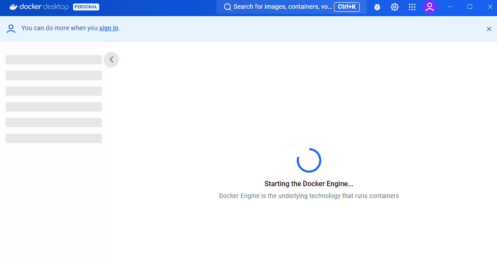
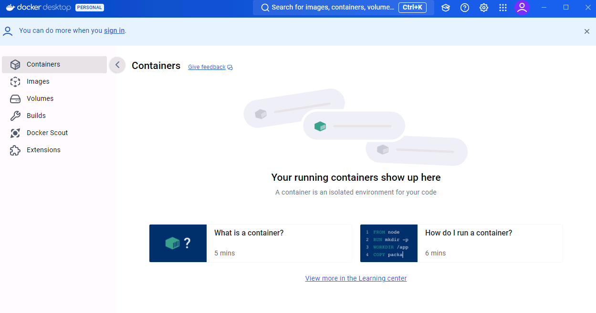
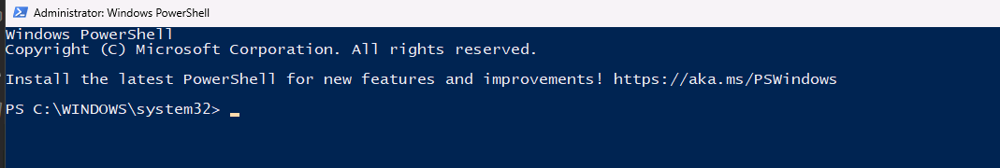
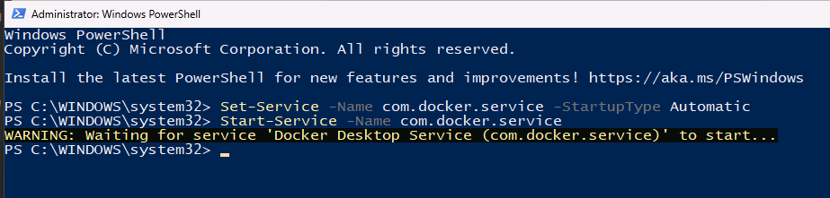
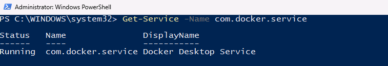
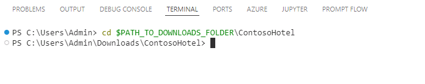
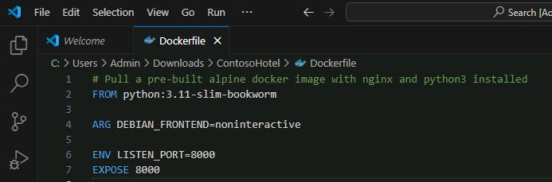
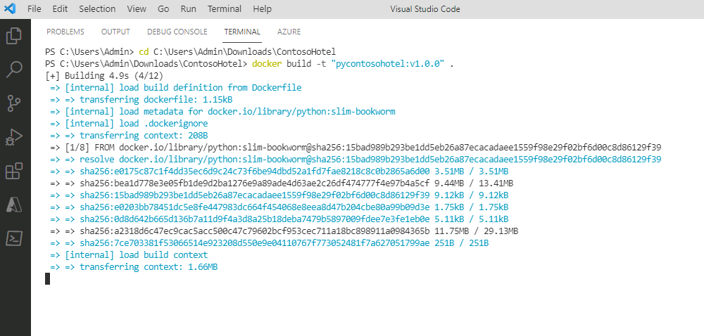

# Task 02 - Build a Docker container for the app

<!--- Estimated time: 7 minutes---> 

## Introduction

You’ll run the legacy Contoso Hotel app in a Docker container. Docker is an open-source platform that automates the deployment, scaling, and management of applications. It uses containerization technology to package an application and its dependencies into a container, ensuring that it runs consistently across different environments.

## Description

In this task, you’ll create the Docker container and add app components to the container.

The key steps are as follows:

1. Launch Docker Desktop. 
1. Verify that the Docker engine is running.
1. Build a Docker container for the app.


## Steps

1. Open **Docker Desktop**. Wait for the app to start. After the app starts, wait for the app to start Docker Engine.
   
   After Docker Engine starts, the Docker UI should resemble the following screenshot. Docker will display any running containers.
   
1. Minimize Docker Desktop but don’t close the app.
1. Enter the following command at the Visual Studio Code Terminal window prompt and select **Enter**. This command allows you to run commands as an administrator.

    ```powershell
    Start-Process powershell -Verb runAs
    ```

1. In the User Account Control window that displays, select **Yes**. A PowerShell window opens.
    
1. Enter the following command at the PowerShell prompt and then select **Enter**. This command configures the Docker daemon to start automatically.

    ```powershell
    Set-Service -Name com.docker.service -StartupType Automatic
    ```

    > :warning: The Set-Service command will fail if you’re not running PowerShell as an administrator.

1. Enter the following command at the PowerShell prompt and then select **Enter**. This command manually starts the Docker daemon.

    ```powershell
    Start-Service -Name com.docker.service
    ```

    

1. Enter the following command at the PowerShell prompt and then select **Enter**. This command checks the status of the Docker daemon. Verify that the results show the Docker daemon is running.

    ```powershell
    Get-Service -Name com.docker.service
    ```

    

1. Minimize the PowerShell window. Return to Visual Studio Code.

1. Modify the file path, if needed, for the following command to point to the **Downloads\ContosoHotel** folder that you created. Enter the command at the Visual Studio Code Terminal window and then select **Enter**. This command switches the context to the folder where the cloned repository resides.

    ```powershell
    $PATH_TO_DOWNLOADS_FOLDER = "C:\Users\Admin\Downloads"
    ```

    ```powershell
    cd $PATH_TO_DOWNLOADS_FOLDER\ContosoHotel
    ```

    

1. Navigate to the Docker file in the root directory of the repository you just cloned. Review the steps docker will use to build your container image and close the file.

    ```powershell
    code Dockerfile
    ```

    


1. Enter the following command at the Terminal window prompt and then select **Enter**. This command builds the container for the app. Wait while the container builds.

    ```powershell
    docker build -t "pycontosohotel:v1.0.0" .
    ```

    

    > 📓 It may take 2-3 minutes to build the container.

1. Leave Visual Studio Code open. You’ll use the tool in the next task.
