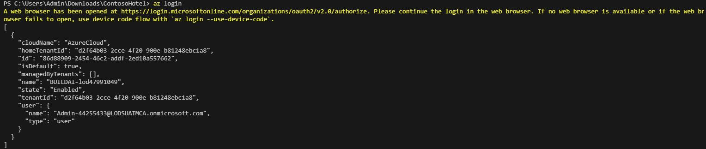
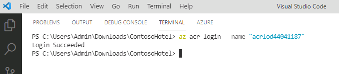
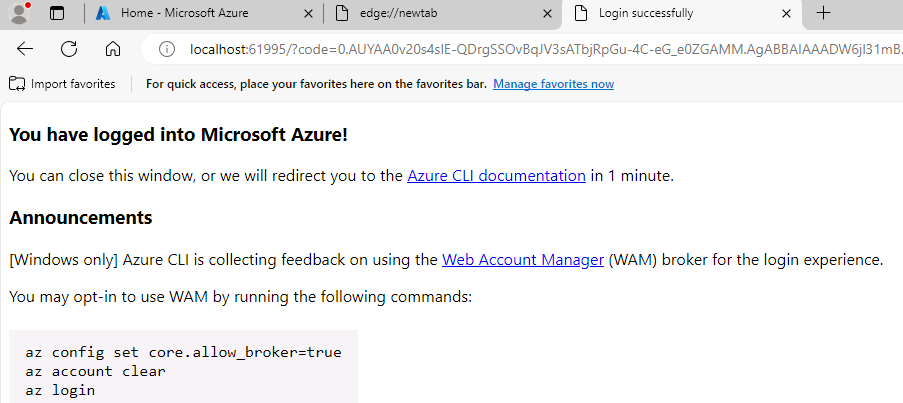
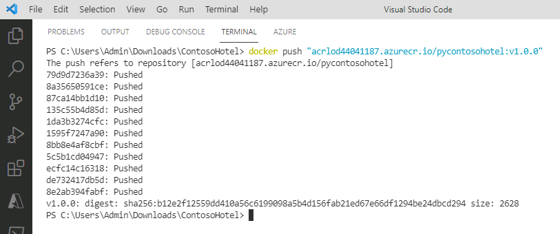

# Task 03 - Push the app container to ACR

## Introduction

Azure Container Registry (ACR) is a managed, private Docker registry service provided by Microsoft Azure. It allows you to store and manage container images and artifacts in a secure and scalable manner. We have already provisioned an ACR for you in this lab environment. If you would like to learn how to create one yourself, check out the documentation, [Manage container images in Azure Container Registry](https://learn.microsoft.com/en-us/training/modules/publish-container-image-to-azure-container-registry/).

## Description

In this task, you’ll sign into your Azure portal, view the existing Azure Container Registry and push your newly created image to the container registry.

The key steps are as follows:

1. Log into the Azure Portal
1. Sign in to ACR and push the app container that you created in the previous task to ACR.

## Success Criteria

- You’ve pushed the app container to ACR.

## Learning Resources

- [**Manage container images in Azure Container Registry**](https://learn.microsoft.com/en-us/training/modules/publish-container-image-to-azure-container-registry/)

## Solution

1. Head over to the azure portal at `portal.azure.com` on your browser.
1. Log in with the provided credentials:
1. At the **Global search bar** at the top of the portal, enter "resource groups" and select it from the dropdown
1. You should find a resource group called "Ignite24". Clicking on it will reveal the resources required for this lab already provisioned for you.
1. Find your **Azure Container Registry** resource and copy it into your notepad ++ to be used later, then set its name as an environment variable using the command below.
    ```powershell
    $ACR_NAME = "<your ACR name>"
    ```

    > :warning: Record the ACR name. You’ll need to supply the ACR name again later in the lab.

1. Enter the following command at the Terminal window prompt and then select **Enter** to log into Azure. 

    ```powershell
    az login
    ```
1. This should pop up a browser requiring you to enter your credentials. If you created an account in a previous step, choose that account. Otherwise choose **work and school account** and enter the credentials provided to you in the **Resources** tab of the lab instructions. If you run into any issues here, run the command "az login --use-device-code" and follow the instructions to authenticate on your browser.

    

1. Enter the following command at the Terminal window prompt and then select **Enter**. This command signs you in to the ACR instance.

    ```powershell
    az acr login --name "$ACR_NAME"
    ```

    
1. If a message displays stating that you’ve logged into Microsoft Azure, close the web page and return to Visual Studio Code.

    

    > :warning: You may see an error message stating the Azure could not connect to the registry login server. This error usually indicates that even though the container registry instance is provisioned, there’s still some configuration happening. Wait a few minutes and run the command again.

1. Enter the following command at the Terminal window prompt and then select **Enter**. This command creates a Docker tag for the app.

    ```powershell
    docker tag "pycontosohotel:v1.0.0" "$ACR_NAME.azurecr.io/pycontosohotel:v1.0.0"
    ```

1. Enter the following command at the Terminal window prompt and then select **Enter**. This command pushes the app container to ACR.

    ```powershell
    docker push "$ACR_NAME.azurecr.io/pycontosohotel:v1.0.0"
    ```

    

    > 📓 It may take 1-2 minutes to push the app container to ACR.
1. Leave Visual Studio Code open. You’ll use the tool in the next task.
