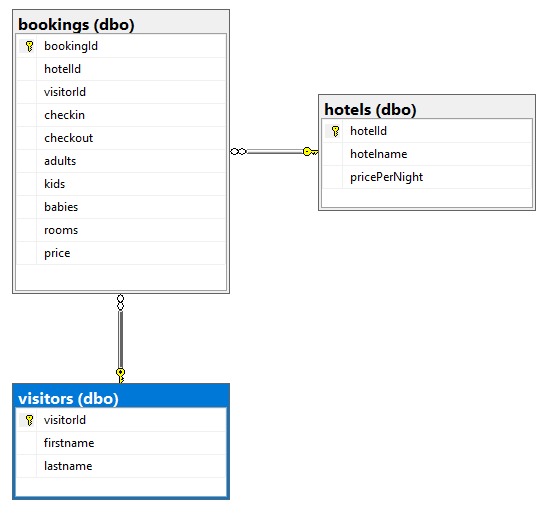
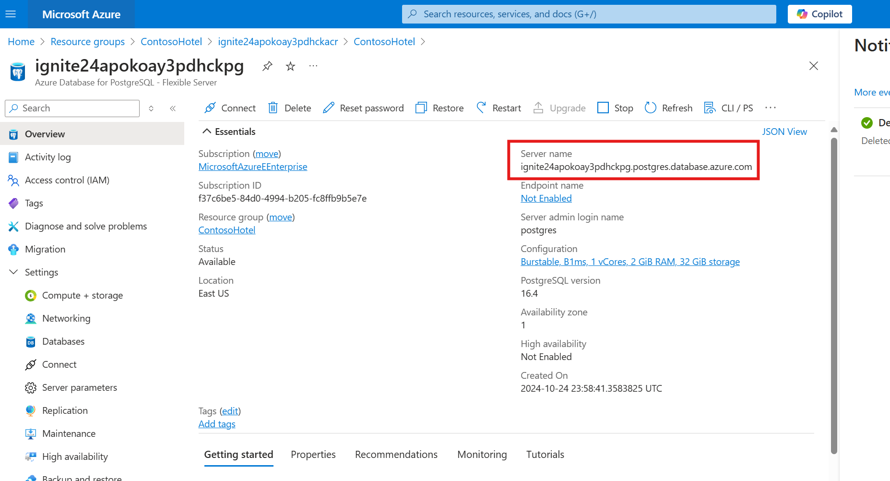
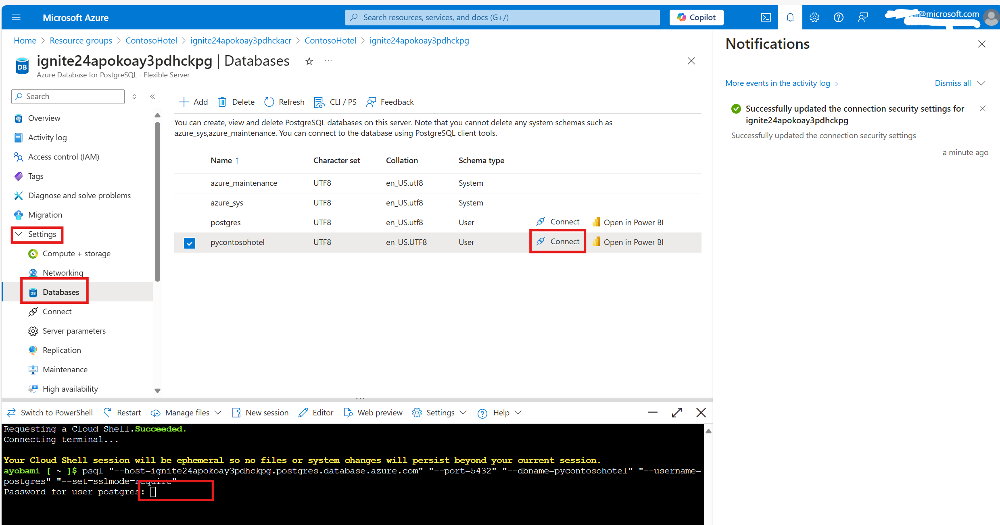

# Task 04 - Review PostgreSQL database to support the app

## Introduction

The Contoso Hotel legacy app stores data in a PostgreSQL database. PostgreSQL is a powerful, open-source relational database management system (RDBMS). It’s known for its robustness, extensibility, and standards compliance. Azure Database for PostgreSQL Flexible Server is a fully managed database service designed to provide more granular control and flexibility over database management functions and configuration settings. 

The database uses the following schema:



## Description

In this task, you’ll provision an Azure Database for PostgreSQL Flexible Server instance. 

The key steps are as follows:

1. Review PostGres instance
1. Get your connection string

## Learning Resources

- [**Explore PostgreSQL architecture**](https://learn.microsoft.com/en-us/training/modules/explore-postgresql-architecture/ )

## Solution

In this task, you’ll review the **Azure Database for PostgreSQL - Flexible Server** provisioned for you and capture your connection string.

1. Head to the Azure Portal and navigate to your **ignite24** resource group.
1. Find the **Azure Database for PostgreSQL - Flexible Server** instance and click on it.
1. Record your Server name which you can find in the top right side of the Overview page.
    
1. Click on the Databases panel under Settings in the left navigation pane
1. Click on the **Connect** button next to the pycontosohotel database and click **Yes** to the popup

    > :warning: For security reasons, you would not want to click Yes for your dev or production workloads at work. This is done purely for demo purposes.

1. After the deployment completes the change to your policy, click on the Connect button again until your terminal looks like is shown in the picture below. You can close the terminal at this point.
    

1. Set the postgres FQDN environment variable in your **VS code PowerShell terminal** (the same terminal you have been using). Replace the placeholder in the command below with the proper values before running the command.

    ```powershell
    $env:PGHOST = "< the Postgres servername you recorded above similar to this format: ignite24apokoay3pdhckpg.postgres.database.azure.com >" 
    ```

1. Set your connection string as an environment variable

    ```powershell
    $env:connectionString = "host=$env:PGHOST;port=5432;database=pycontosohotel;user=contosoadmin;password=1234ABcd!;"
    echo $env:connectionString
    ```

1. The *POSTGRES_CONNECTION_STRING* should resemble the following. Record the connection string for use later in the lab: 

    ```powershell
    host=53pkyjrx5j7ve.postgres.database.azure.com;port=5432;database=pycontosohotel;user=contosoadmin;password=1234ABcd!;
    ```

1. Leave Visual Studio Code open. You’ll use the tool in the next task.
