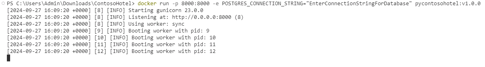
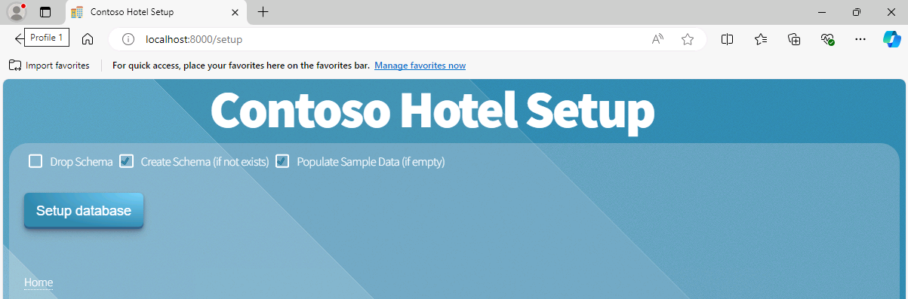
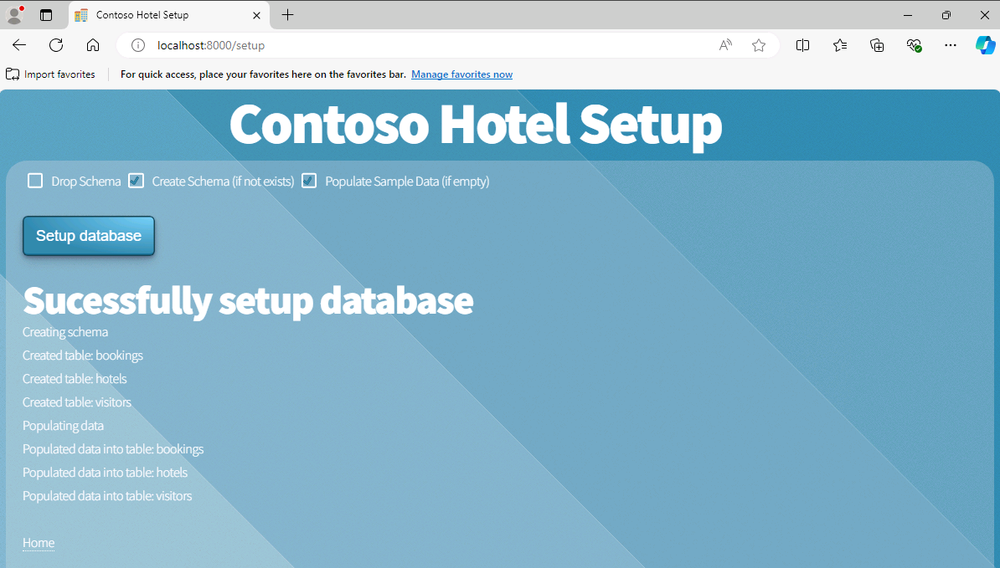
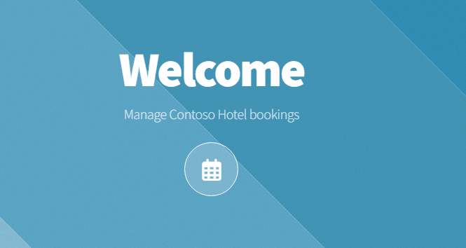
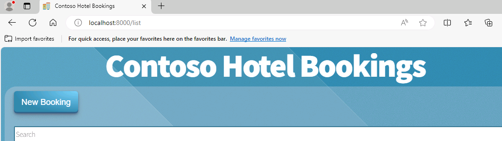
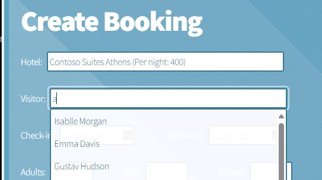
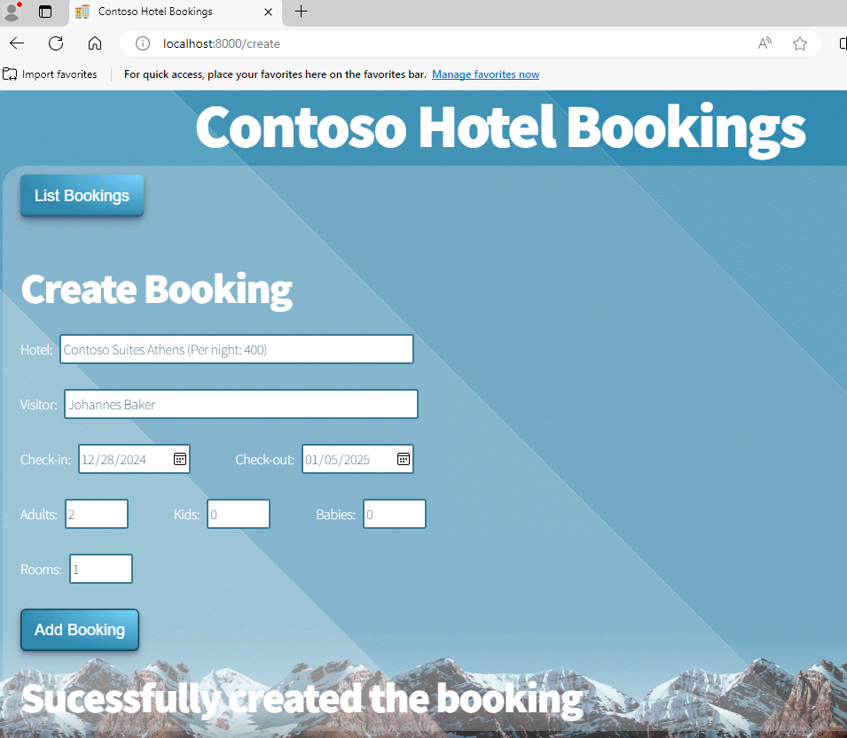
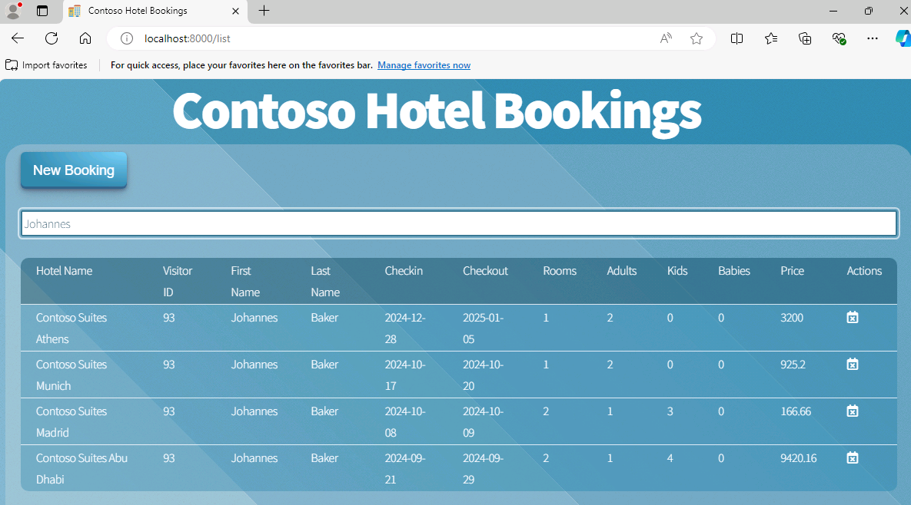

# Task 05 -  Run the containerized app and add a booking

## Introduction

You created a Docker container and pushed the container to ACR in previous tasks. Now, you’ll run the container and view the app in a browser. Since this is the first time you are running the app, you’ll need to run a process to create the database schema and populate the tables with data.

Now, you can view the various pages for the app and try out the features.
 

## Description

In this task, you’ll run the Docker app container and then display the setup page for the app. You’ll create the database schema and populate the tables with data. You’ll review common app pages and add a booking record. Finally, you’ll search for the record you just added to verify that the record was successfully added to the database.

## Learning Resources

[**Manage container images in Azure Container Registry**](
https://learn.microsoft.com/en-us/training/modules/publish-container-image-to-azure-container-registry/ "Manage container images in Azure Container Registry")

## Solution

1. Assuming you successfully created your environment variable for `connectionString` in the previous step, enter the command at the Visual Studio Code Terminal window prompt and then select **Enter**. This command starts the containerized app.
    > :warning: Ensure your Docker Desktop is running before running the command below. If Docker desktop says Docker is stopped, you can close the program and reopen it.

    ```
    docker run -p 8002:8000 -e POSTGRES_CONNECTION_STRING=$env:connectionString pycontosohotel:v1.0.0
    ```

    

    > ⚠️ You may minimize Visual Studio Code but don’t close the Visual Studio Code Terminal window at this time.

1. Open a web browser and go to **http://localhost:8002/setup**. The **Contoso Hotel Setup** page displays.

    

1. On the **Contoso Hotel Setup** page, select **Setup database**. This launches a script that creates the database schema and populates the tables with data.

    > 📓 The page updates when the script completes.

    

1. On the **Contoso Hotel Setup** page, select **Home**. The **Home** page for the app displays.

1. On the **Home** page, select the calendar icon to go to the **Bookings** page.

    

1. On the **Bookings** page, select **New Booking**.

    

1. Enter the following information into the page and then select **New Booking**. The page will update to show you that the booking is successfully created.

    | Field | Value |
    |:---------|:---------|
    | Hotel   | **Contoso Suites Athens**   |
    | Visitor   | <Any name available in the Visitor field>|
    | Check-in   | **12/28/2024**|
    | Check-out   | **01/05/2025**|
    | Adults   | **2**|
    | Rooms   | **1**|

    > ⚠️ The **Visitor** field doesn't search properly. Type in the letter 'a' into the field and select a name from the dropdown list.

    

    

1. On the **Bookings** page, select **List Bookings**.

1. Enter **Emma Davis**, or whichever Visitor you selected, in the **Search** field. The booking that you created should appear in the list of bookings.

    

1. Close the browser window.

1. In Visual Studio Code, select **Ctrl+C** from the Terminal pane to exit the running worker processes.

1. Leave Visual Studio Code open. You’ll use the tool again in the next exercise.
