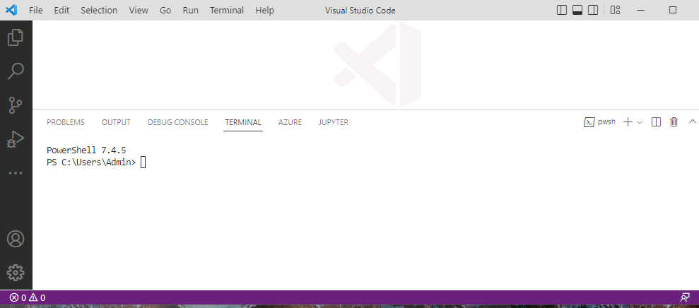

# Task 06 - Separate front-end components from back-end components

## Introduction

The Contoso Hotel legacy app is monolithic. That is, front-end components and back-end components are deployed as a single unit. Mololithic apps don’t scale very well. Contoso wants to ensure that the app scales to meet expected increases in demand.

Please note that there are many ways to split your application into Microservices. In this workshop, we are only going to be splitting the app into a frontend service and a backend service for simplicity. This will allow us to add a 3rd service that will add new features, in this case, AI features to the application. For more information about splitting applications into Microservices, check out [Migrate a monolithic application to microservices using domain-driven design](https://learn.microsoft.com/en-us/azure/architecture/microservices/migrate-monolith). For a comprehensive guide on building microservices, check out the [Microservices architecture design](https://learn.microsoft.com/en-us/azure/architecture/microservices/) guides.

## Description

In this task, you’ll clone a repository that has the apps split into frontend and backend because of the limited time available for this lab. For more details about the steps taken to get there, check out [Separate front-end components from back-end components](https://microsoft.github.io/TechExcel-Modernize-applications-to-be-AI-ready/Docs/Ex03/0301.html) **after** this lab.

## Learning Resources

- [**Decompose a monolithic application**](https://learn.microsoft.com/en-us/training/modules/microservices-architecture/ )
- [**Azure Migrate application and code assessment**](https://learn.microsoft.com/en-us/azure/migrate/appcat/overview )

## Solution

1. Open Visual Studio Code.

1. On the Visual Studio Code menu bar, select **Terminal** and then select **New Terminal**. A Terminal pane opens at the bottom of the window.

    

1. Update the value for the $PATH_TO_DOWNLOADS variable to point to the **Downloads** folder on your machine. Enter the following commands at the Terminal window prompt to set the variable and change directories to that folder, which contains the repository files you cloned in Exercise 01.

    ```powershell
    $PATH_TO_DOWNLOADS = "C:\Users\Admin\Downloads"
    cd "$PATH_TO_DOWNLOADS\ContosoHotel"
    ```

1. Clone the repo that already has the Frontend and Backend Split

    ```powershell
    git clone https://github.com/mosabami/ContosoHotelMicroservice UpdatedApp
    ```

1. Leave Visual Studio Code open. You’ll use the tool again in the next task.
