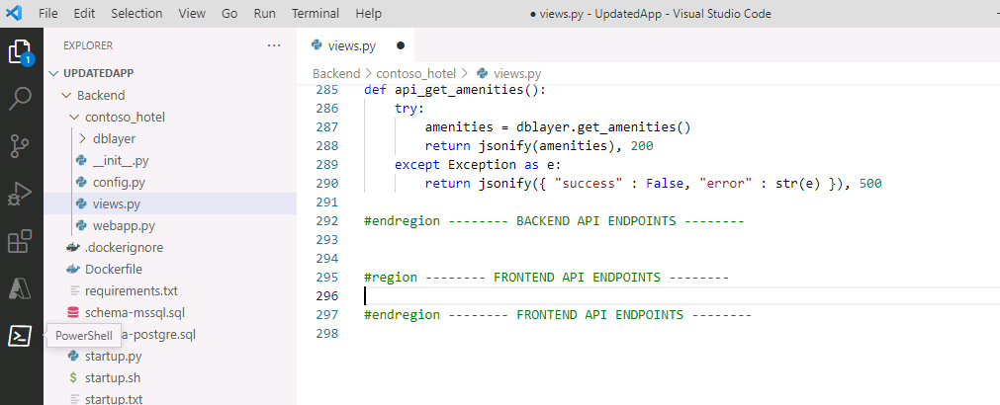

# Task 07 - Refactor files

## Introduction

The *views.py* file defines app routes, endpoints, and views. The file is divided into the following sections:

- Import statements
- Back-end API endpoints
- Front-end API endpoints

The **Dockerfile** file defines the Docker image to use and provides instructions for copying app components to the Docker container when you build the container.

The **requirements.txt** file specifies the packages that the app requires to run.

## Description

In the previous task, you added a copy of **views.py** to both the **FrontEnd** and **Backend** folders. You added the Dockerfile file and the **requirements.txt** file to the **FrontEnd** folder. In this task, you’ll modify all three files to remove references to back-end functionality. You’ll also modify the copy of **views.py** in the **Backend** folder to remove references to front-end functionality.

## Solution

In this task, you’ll refactor the front-end **views.py** file in the **UpdatedApp\FrontEnd** folder.


1. In Visual Studio Code, select **File** at the top left corner of the screen, then select **Open Folder...**

1. In the **Open Folder** dialog, select the **Downloads** folder, select **ContosoHotel**, select **UpdatedApp**, and the select **Select Folder**.

1. In the **Do you trust the authors of the files in this folder?** dialog, select **Trust the authors of all files in the parent folder 'Downloads'** and then select **Yes, I trust the authors**. 

    

1. In the Explorer pane, expand the **frontend** folder and then expand the **contoso_hotel** folder.

1. Select **views.py**. The file displays in the right side of the Visual Studio Code window.

1. Delete all code between the following region markers in the code (at or around lines 9 - 304):

    ```
    ####region -------- BACKEND API ENDPOINTS --------
    ####endregion -------- BACKEND API ENDPOINTS --------
    ```

    

1. Locate the line of code that imports **dblayer** (at or around line 4). 

    

1. Remove **dblayer,**.

    

    > :warning: Don’t forget to delete the comma after **dblayer**.

1. Locate the code that checks to see if the database is set up (at or around lines 22-26):

    

1. Delete the code that performs the database check.

    

1. Save and close the file.

1. In the Visual Studio Code Explorer pane, select **Dockerfile**. The file displays in the right side of the Visual Studio Code window.

    

1. Locate the code that installs the MSSQL ODBC driver (at or around lines 17-23):

    

1. Delete the code that installs the MSSQL ODBC driver.

    

1. Save and close the file.

1. In the Visual Studio Code Explorer pane, select **requirements.txt**. The file displays in the right side of the Visual Studio Code window.

    

1. Delete the **pyodbc** and **psycopg2-binary** libraries.

    

1. Save and close the file.

1. In the Explorer pane, expand the **backend** folder and then expand the **contoso_hotel** folder.

1. Select **views.py**. The file displays in the right side of the Visual Studio Code window.

1. Delete all code between the following region markers in the code (around lines 309 - 332):
    ```
    #region -------- FRONTEND API ENDPOINTS --------
    #endregion -------- FRONTEND API ENDPOINTS --------
    ```

    

1. Save and close the file.
1. Leave Visual Studio Code open. You’ll run additional commands in the next task.