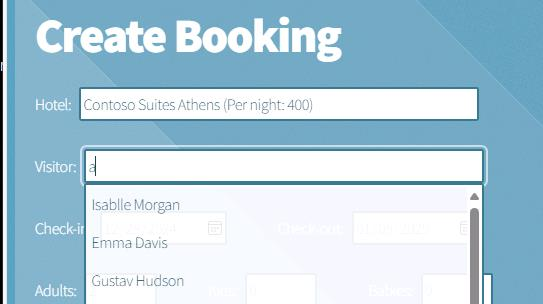
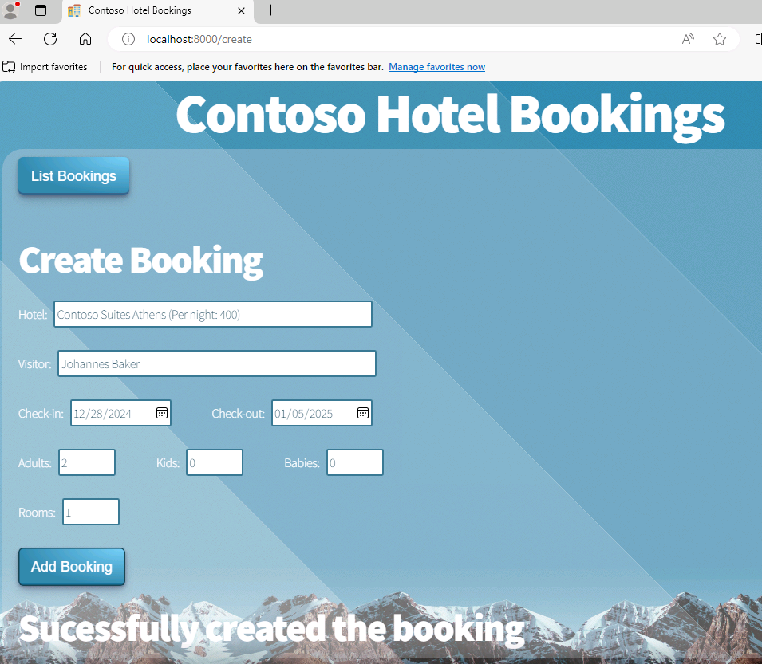
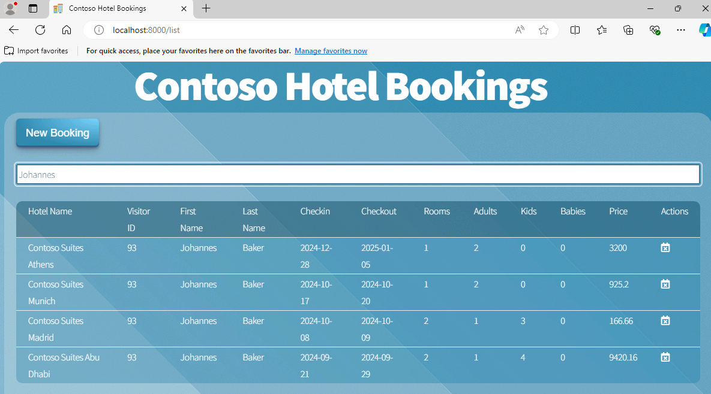

# Task 08 - Build the containers for front-end and back-end components and push the containers to Azure

## Introduction

You ran the legacy ContosoHotel app as a single Docker container. You’ve split up the front-end and back-end components into separate folders. Now, it’s time to build separate containers for front-end and back-end components and push the containers to ACR.


## Description

In this task, you’ll build separate containers for front-end and back-end components.

## Learning Resources

- [**az containerapp create**](https://learn.microsoft.com/en-us/cli/azure/containerapp?view=azure-cli-latest#az-containerapp-create )
- [**az containerapp env**](https://learn.microsoft.com/en-us/cli/azure/containerapp/env?view=azure-cli-latest )
- [**az containerapp ingress cors**](https://learn.microsoft.com/en-us/cli/azure/containerapp/ingress/cors?view=azure-cli-latest )


## Solution

In this task you’ll build a Docker container for the updated app front-end components.

1. In the list of resources, locate the Container Registry instance and get the name (not including the .azurecr.io part). Select **Terminal** from the top menu of your VS code window from the previous step (the VS code window that has the **Frontend** and **Backend** folders) and select **New Terminal**. Make sure it is a PowerShell terminal. Update the variable in the command below to use the name of the Azure Container Registry instance (ACR) and run the command in the terminal.

    ```
    $ACR_NAME="ACR_NAME_FROM_AZURE_PORTAL"
    ```

1. Update the value for the $PATH_TO_UPDATED_APP variable to point to the **Downloads\ContosoHotel\UpdatedApp** folder on your machine. Enter the following commands at the Terminal window prompt. These commands switch the context to the folder that contains the updated app components.

    ```
    $PATH_TO_UPDATED_APP = "C:\Users\ADMIN\Downloads\ContosoHotel\UpdatedApp"
    ```

1. In Visual Studio Code, enter the following command at the Terminal window prompt. This command ensures that you are working in the correct folder.

    ```
    cd  $PATH_TO_UPDATED_APP\Frontend
    ```

    

1. Enter the following command at the Terminal window prompt. This command builds the container for the front-end app components.

    ```
    docker build -t "pycontosohotel-frontend:v1.0.0" .
    ```

     > 📓 It may take 2-3 minutes to build the Docker container.

    

1. Enter the following commands at the Terminal window prompt. These commands tag the front-end container and push the container to ACR.

    ```powershell
    az acr login -n $ACR_NAME
    ```

    ```powershell
    docker tag "pycontosohotel-frontend:v1.0.0" "$ACR_NAME.azurecr.io/pycontosohotel-frontend:v1.0.0"
    docker push "$ACR_NAME.azurecr.io/pycontosohotel-frontend:v1.0.0"
    ```

    

1. Enter the following commands at the Terminal window prompt. These commands switch the context to the **Backend** folder and then build the Docker container for the back-end app components.

    ```
    cd  $PATH_TO_UPDATED_APP\Backend
    docker build -t "pycontosohotel-backend:v1.0.0" .
    ```

     > 📓 It may take 2-3 minutes to build the Docker container.

1. Enter the following commands at the Terminal window prompt. These commands tag the back-end container and push the container to ACR.

    ```
    docker tag "pycontosohotel-backend:v1.0.0" "$ACR_NAME.azurecr.io/pycontosohotel-backend:v1.0.0"
    docker push "$ACR_NAME.azurecr.io/pycontosohotel-backend:v1.0.0"
    ```

   > 📓 It may take 2-3 minutes for these commands to complete.

1. Set the environment variable for your Azure region

    ```
    $AZURE_REGION="<location instructed to use eg 'South Central US'. You can get this value from the Portal where you can see region ACR was deployed in>"
    ```

1. Go on your Azure portal. Within the **Ignite24** resource group, you will see an Azure Container App Environment already provisioned for you. Set the name of that enviroment variable for use in the future

    ```powershell
    $CONTOSO_HOTEL_ENV = "<your ACA environment name>"
    ```

1. Enter the following commands at the Terminal window prompt. These commands will display the container app environment default domain as well as get the ACR credential required for the container app to be create.

    ```powershell
    $CONTOSO_ACR_CREDENTIAL = az acr credential show --name $ACR_NAME --query "passwords[0].value" -o tsv
    echo $CONTOSO_ACR_CREDENTIAL
    ```

   > :warning: Make sure you get a valid password output on the echo command above. If you don't, you might have to get the ACR password from the ACR instance in Azure Portal and set the variable manually.

1. Set the postgres FQDN environment variable in your **VS code PowerShell terminal** like you did in the previous terminal. Replace the placeholder in the command below with the proper values before running the command.

    ```powershell
    $env:PGHOST = "< the Postgres servername you recorded above similar to this format: ignite24apokoay3pdhckpg.postgres.database.azure.com >" 
    ```

1. Set your connection string as an environment variable

    ```powershell
    $env:connectionString = "host=$env:PGHOST;port=5432;database=pycontosohotel;user=contosoadmin;password=1234ABcd!;"
    echo $env:connectionString
    ```

1. The *POSTGRES_CONNECTION_STRING* should resemble the following. Record the connection string for use later in the lab: 

    ```powershell
    host=53pkyjrx5j7ve.postgres.database.azure.com;port=5432;database=pycontosohotel;user=contosoadmin;password=1234ABcd!;
    ```

1. Enter the command at the Visual Studio Code Terminal window prompt and then select **Enter**. These commands create the container app for the back-end app components.

    ```powershell
    az containerapp create --name "backend" --resource-group "Ignite24" --environment "$CONTOSO_HOTEL_ENV" --image "$ACR_NAME.azurecr.io/pycontosohotel-backend:v1.0.0" --target-port 8000 --ingress external --transport http --registry-server "$ACR_NAME.azurecr.io" --registry-username "$ACR_NAME" --registry-password "$CONTOSO_ACR_CREDENTIAL" --env-vars "POSTGRES_CONNECTION_STRING=$env:connectionString"
    $CONTOSO_BACKEND_URL = "https://$(az containerapp show --name "backend" --resource-group "Ignite24" --query 'properties.configuration.ingress.fqdn' -o tsv)"
    Write-Host -ForegroundColor Green  "Backend URL is: $CONTOSO_BACKEND_URL"
    ```

    

    > 📓 Record the value for the back-end URL. You’ll use the value later in the lab.

1. Enter the following commands at the Terminal window prompt. These commands create the container app for the front-end app components.

    ```powershell
    az containerapp create --name "frontend" --resource-group "Ignite24" --environment "$CONTOSO_HOTEL_ENV" --image "$ACR_NAME.azurecr.io/pycontosohotel-frontend:v1.0.0" --target-port 8000 --ingress external --transport http --registry-server "$ACR_NAME.azurecr.io" --registry-username "$ACR_NAME" --registry-password "$CONTOSO_ACR_CREDENTIAL" --env-vars "API_BASEURL=$CONTOSO_BACKEND_URL"
    $CONTOSO_FRONTEND_URL = "https://$(az containerapp show --name "frontend" --resource-group "Ignite24" --query 'properties.configuration.ingress.fqdn' -o tsv)"
    Write-Host -ForegroundColor Green  "Frontend URL is: $CONTOSO_FRONTEND_URL"
    ```

    > 📓 Record the value for the front-end URL. You’ll use the value later in the lab.

1. Open a browser tab and navigate to the front-end url, adding "/setup" to the end of the URL if you dont automatically get directed there.
1. On the **Contoso Hotel Setup** page, select **Setup database**. This launches a script that creates the database schema and populates the tables with data.

    > 📓 The page updates when the script completes.

    

1. On the **Contoso Hotel Setup** page, select **Home**. The **Home** page for the app displays.

1. On the **Home** page, select the calendar icon to go to the **Bookings** page.

    

1. On the **Bookings** page, select **New Booking**.

    

1. OPTIONAL: Enter the following information into the page and then select **New Booking**. The page will update to show you that the booking is successfully created.

    | Field | Value |
    |:---------|:---------|
    | Hotel   | **Contoso Suites Athens**   |
    | Visitor   | <Any name available in the Visitor field>|
    | Check-in   | **12/28/2024**|
    | Check-out   | **01/05/2025**|
    | Adults   | **2**|
    | Rooms   | **1**|

    > ⚠️ The **Visitor** field doesn't search properly. Type in the letter 'a' into the field and select a name from the dropdown list.

    

    

1. On the **Bookings** page, select **List Bookings**.

1. Enter **Bernd Schuster**, or whichever Visitor you selected, in the **Search** field. The booking that you created should appear in the list of bookings.

    

1. Close the browser window.

1. In Visual Studio Code, select **Ctrl+C** from the Terminal pane to exit the running worker processes.

1. Leave Visual Studio Code open. You’ll use the tool again in the next exercise.

