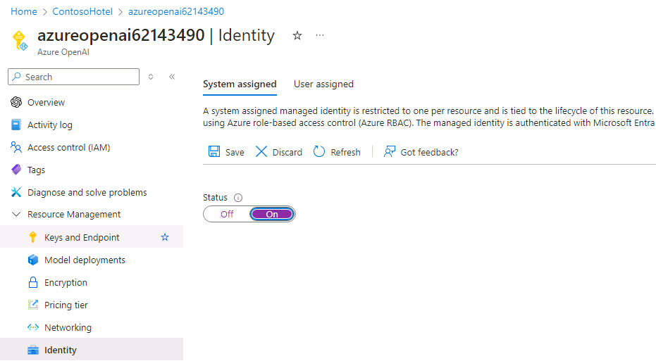
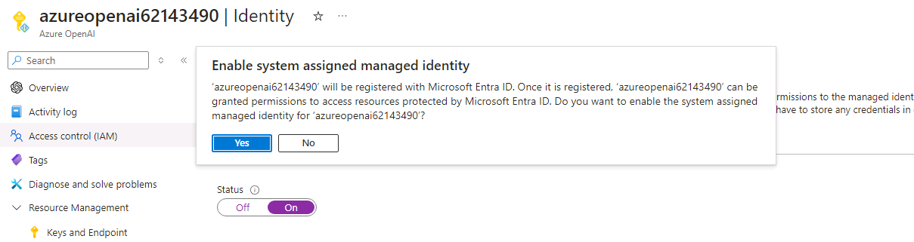

# Task 10 - Configure managed identities for deployed Azure resources

## Introduction

Managing permissions and access for users and Azure resources can be challenging. Managed identities help you deploy secure solutions on Azure without the need to manage credentials. You can create system-assigned and user-assigned managed identities. For this lab, you’ll use system-assigned managed identities. You enable this type of identity directly on the Azure resource.

## Description

In this task, you’ll create a set of managed identities so that the various Azure resources you created can communicate with each other.

## Learning Resources

- [**Implement managed identities**](https://learn.microsoft.com/en-us/training/modules/implement-managed-identities/)

## Solution

1. Open a browser window and go to [**Azure portal**](https://portal.azure.com). Sign in to Azure.

1. On the Azure Home page, select **Resource groups** and then select **Ignite24**.

1. In the list of services, select the **Azure OpenAI** resource you created.

1. In the left navigation pane, in the **Resource Management** section, select **Identity**.

1. Verify that the value for the **Status** field on the **System assigned** tab is set to **On** then hit **Save**.

    

1. If prompted, select **Yes** to confirm the change. System assigned managed identity for the other resources can be enabled using similar steps, but this has already automatically been done for you.

    

1. Enter the following commands at the Terminal window prompt. These commands allow the Azure Search and Azure OpenAI instances to access the Azure Blob Storage account.

    ```
    $SEARCH_IDENTITY=$(az search service show --name $CONTOSO_SEARCH_SERVICE_NAME --resource-group Ignite24 --query identity.principalId -o tsv)
    $AI_IDENTITY=$(az cognitiveservices account identity show --name $CONTOSO_AI_NAME --resource-group Ignite24 --query principalId -o tsv)
    $STORAGE_SCOPE=$(az storage account show --name $CONTOSO_STORAGE_ACCOUNT_NAME --resource-group Ignite24 --query id -o tsv)
    az role assignment create --role "Storage Blob Data Contributor" --assignee $SEARCH_IDENTITY --scope $STORAGE_SCOPE
    az role assignment create --role "Storage Blob Data Contributor" --assignee $AI_IDENTITY --scope $STORAGE_SCOPE
    ```

1. Enter the following commands at the Terminal window prompt. These commands allow the Azure Search to access the Azure OpenAI Service instance you created.

    ```
    $AI_SCOPE=$(az cognitiveservices account show --name $CONTOSO_AI_NAME --resource-group Ignite24 --query id -o tsv)
    az role assignment create --role "Cognitive Services OpenAI Contributor" --assignee $SEARCH_IDENTITY --scope $AI_SCOPE
    ```

1. Enter the following commands at the Terminal window prompt. These commands allow the Azure OpenAI Service instance to access the Azure Search Service instance you created.

    ```
    $SEARCH_SCOPE=$(az search service show --name $CONTOSO_SEARCH_SERVICE_NAME --resource-group Ignite24 --query id -o tsv)
    az role assignment create --role "Search Index Data Contributor" --assignee $AI_IDENTITY --scope $SEARCH_SCOPE
    az role assignment create --role "Search Index Data Reader" --assignee $AI_IDENTITY --scope $SEARCH_SCOPE
    az role assignment create --role "Search Service Contributor" --assignee $AI_IDENTITY --scope $SEARCH_SCOPE
    ```
1. Leave Visual Studio Code open. You’ll run additional commands in the next task.
