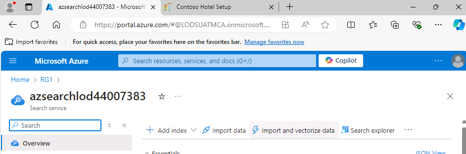
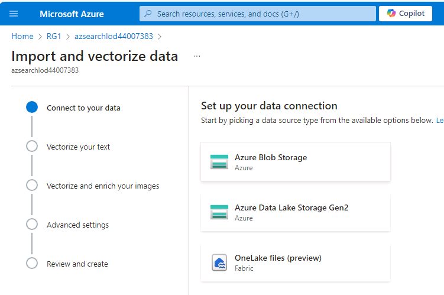
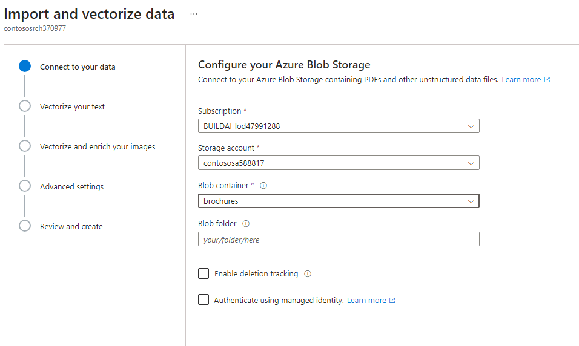
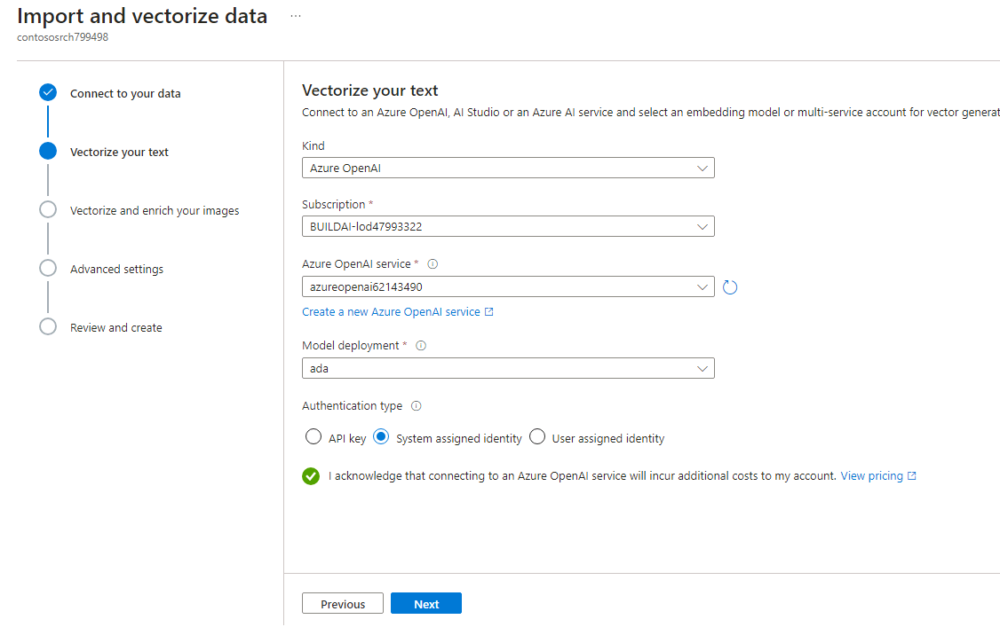
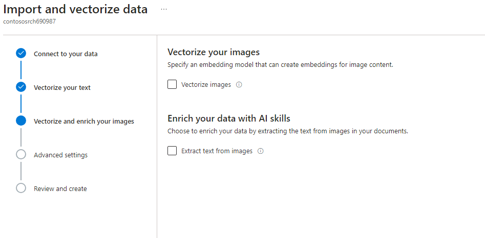
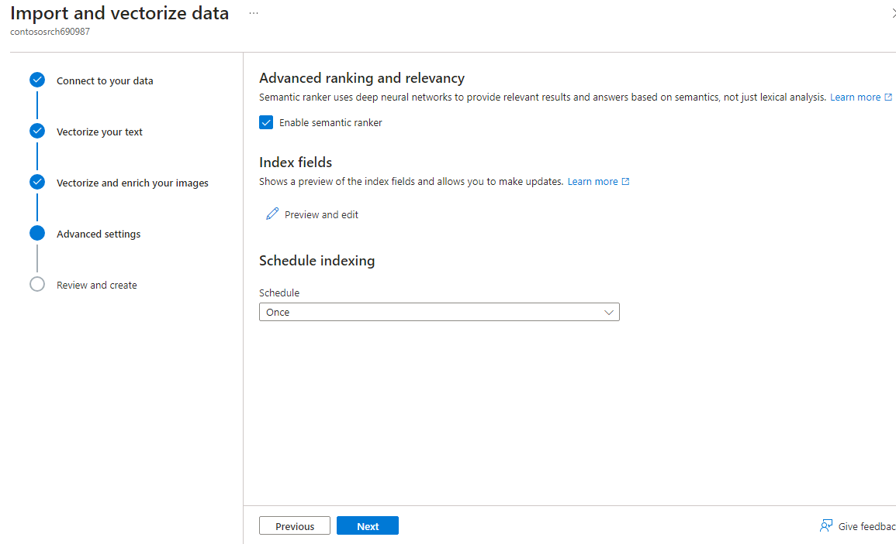
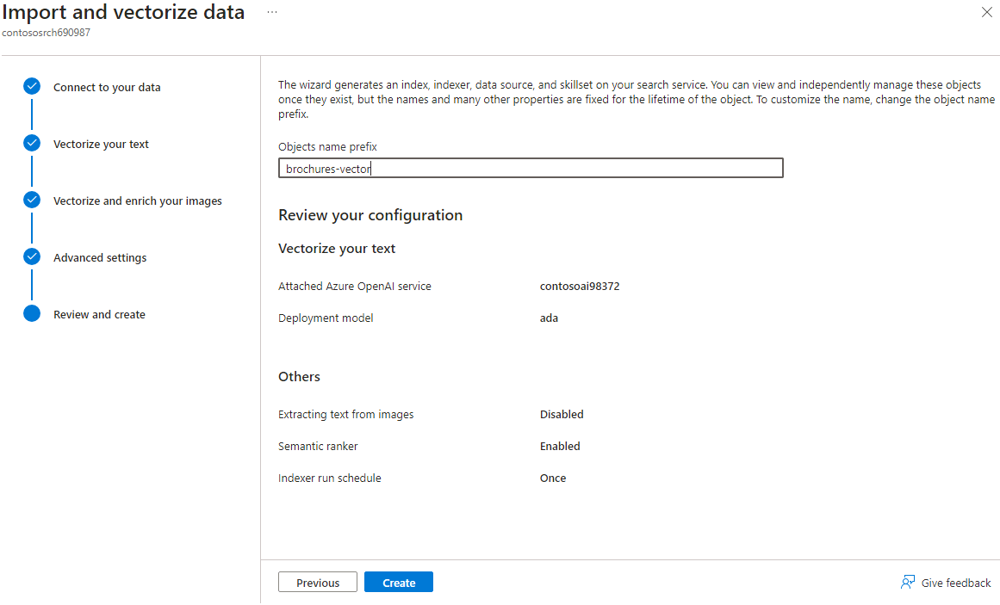
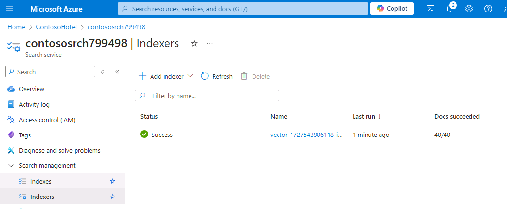
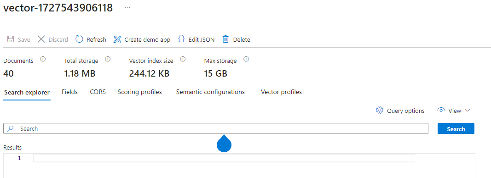
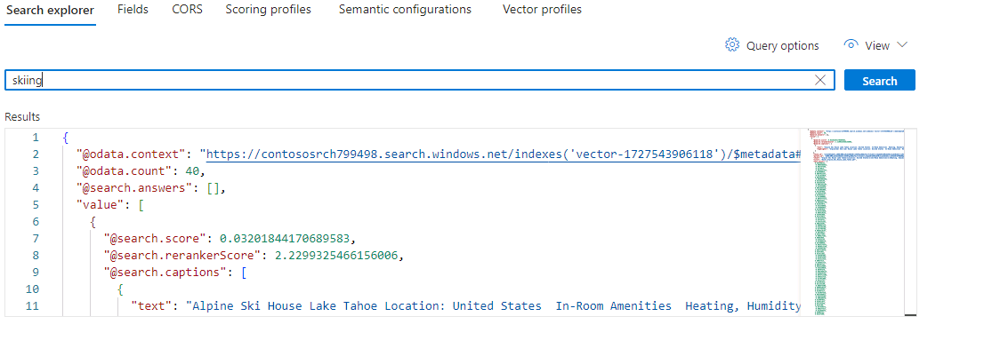

# Task 11 - Configure Azure AI Search to extract data from the brochures and test the search index

## Introduction

Azure AI Search includes a wizard that allows you to import and vectorize data. You’ll use the wizard to extract and vectorize data from the hotel brochures.

## Description

In this task, you’ll use Azure AI Search to import and vectorize data from the hotel brochures. You’ll then test the index.

## Learning Resources

- [**Azure Search Overview**](https://learn.microsoft.com/en-us/azure/search/search-what-is-azure-search)
- [**Integrated data chunking and embedding in Azure AI Search**](https://learn.microsoft.com/en-us/azure/search/vector-search-integrated-vectorization)
- [**Quickstart: Vectorize text and images by using the Azure portal**](https://learn.microsoft.com/en-us/azure/search/search-get-started-portal-import-vectors?tabs=sample-data-storage%2Cmodel-aoai%2Cconnect-data-storage)
- [**Manage your Azure AI Search service with the Azure CLI**](https://learn.microsoft.com/en-us/azure/search/search-manage-azure-cli)

## Solution

1. Open a browser window and go to [**Azure portal**](https://portal.azure.com). Sign in to Azure.

1. On the Azure Home page, select **Resource groups** and then select **Ignite24**.

1. In the list of resources that displays, select the **Search service** instance from the list of resources.

1. On the **Overview** page for the Search service, select **Import and vectorize data**.

    

1. On the **Connect to your data** page, select **Azure Blob Storage**.

    

1. On the **Configure your Azure Blob Storage** page, enter the following information and then select **Next**. Wait while Azure validates the connection:

    | Setting | Value |
    |:---------|:---------|
    | Storage acccount   | Use the name for the storage account that you created in Exercise 04, Task 01, Step 11  |
    | Blob container   | **brochures**| 

    > :warning: The data import wizard will fail at this step if you haven’t uploaded any brochures to the storage container.

    

1. On the **Vectorize your text** page, enter the following information:

    | Setting | Value |
    |:---------|:---------|
    | Kind   | **Azure OpenAI**  |
    | Azure OpenAI service  | The name you azure OpenAI service in the found in the portal.|  
    | Model deployment | **text-embedding-ada-002** |
    |Authentication type | **System assigned identity**|

    

1. Select the checkbox to acknowledge that connecting to Azure OpenAI service will incur costs and then select **Next**. Select **Next** again to skip the **Vectorize and enrich your images** step.

    

1. On the **Advanced settings** page, if you see the **Enable semantic ranker** field, make sure it is checked. The new version being rolled out has it automatically enabled.
1. In the **Schedule indexing** dropdown list, select **Once**.

    

1. On the **Review and create** page, enter **brochures** in the **Objects name prefix** text field and then select **Create**. Wait for the creation process to complete and select **Close**.

    

    > :warning: Make sure you set the Objects name prefix to 'brochures-vector' or you might have to take extra configuration steps later. It should take only a few minutes for the Import and vectorize data tool to index the data from the 40 hotel brochures.

1. In the left navigation pane for the **Search Service** instance, in the **Search management** section, select **Indexers**.

    

     > :warning: The Status for the indexer should be *Success*. If the Status indicates that indexing is still in progress, wait a few minutes and refresh the page. If the Status shows as *Failed*, select the indexer to review error messages and then notify your coach.

1. In the left navigation pane for the **Search Service** instance, in the **Search management** section, select **Indexes** and then select the index called **brochures-vector**.

    

1. In the **Search** field, enter **Skiing** and then select **Search**.

1. Review the output from the search operation. The results should list data about skiing and should also contain a text vector.

    

1. Leave Visual Studio Code open. You’ll run additional commands in the next exercise.