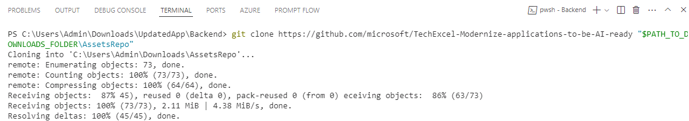
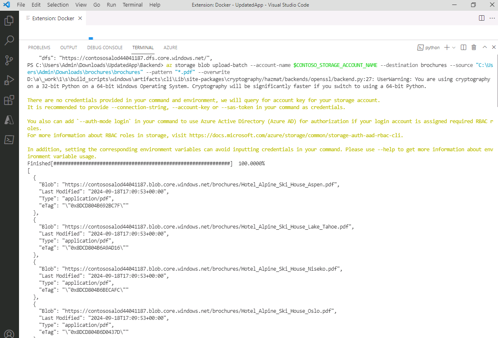
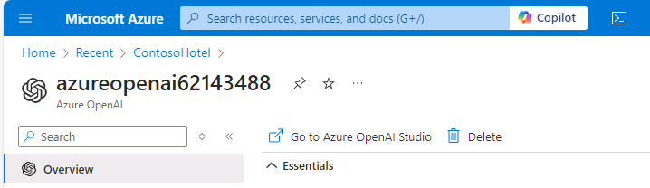
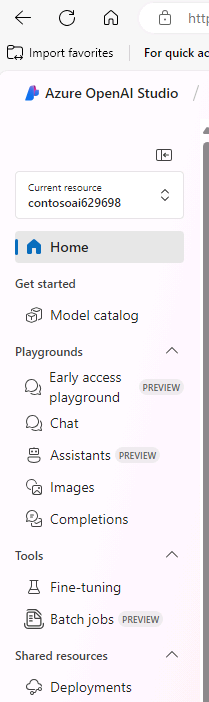
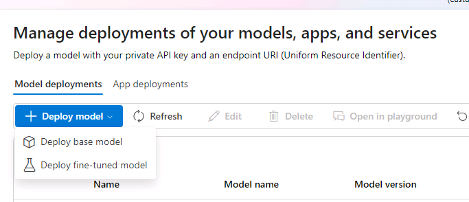
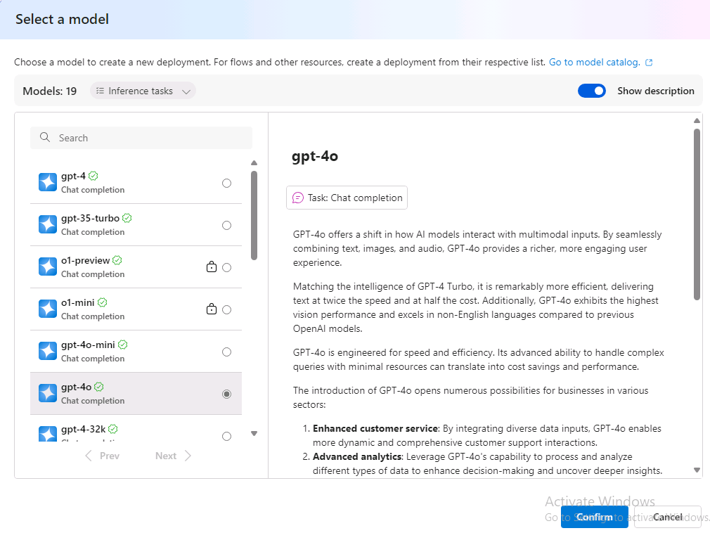

# Task 09 - Create Storage Assets

## Introduction

You can use Azure Blob Storage to store the brochures for the hotels. Storing the brochures in Azure Blob Storage ensures that the brochures are available for searching by Azure AI Search Service.

Azure AI services is a set of cloud-based APIs that you can use in AI applications and data flows. This lab uses Azure OpenAI Service and Azure AI Search to scan and index the data from the hotel brochures. 

Azure OpenAI services allow you to deploy a variety of large language models so that you can enhance applications by adding AI capabilities.

## Description

In this task, you’ll add an Azore storage container to an existing Storage account and then upload a set of PDF files to the storage account. Each PDF file is a brochure for one of the hotels represented in the Contoso Hotels app. Then, you’ll leverage the Azure Search Service and Azure OpenAI Service instancs to add AI features to the App you just deployed.

## Learning Resources

- [**Create an Azure Storage account**](https://learn.microsoft.com/en-us/training/modules/create-azure-storage-account/ )
- [**Create a storage container**](https://learn.microsoft.com/en-us/training/modules/create-azure-storage-account/5-exercise-create-a-storage-account)
- [**GitHub repository with assets for this workshop**](https://github.com/microsoft/TechExcel-Modernize-applications-to-be-AI-ready )

## Solution

1. In Visual Studio Code, enter the following commands at the Terminal window prompt. This command ensures that you’re still signed in.

    ```
    az login
    ```

1. If $AZURE_REGION is not still set, update the value of the **AZURE_REGION_PROVIDED** variable to use the region provided for this workshop.

    ```
    $AZURE_REGION="AZURE_REGION_PROVIDED"
    ```

1. 1. Open a browser window and go to [**Azure portal**](https://portal.azure.com). Sign in to Azure.

1. On the Azure Home page, select **Resource groups** and then select **Ignite24**.

1. In the list of resources that displays, sort the resources by the Type column. Locate the row for the Storage account that was created and record the Storage account name. You’ll need the name in an upcoming task. Set the environment variable to the name of that Storage account.
   
    ```
    $CONTOSO_STORAGE_ACCOUNT_NAME="<your storage account name>"
    ```

1. Create a storage container within that storage account
    ```powershell
    az storage container create --name brochures --account-name $CONTOSO_STORAGE_ACCOUNT_NAME
    ``` 

1.  Open File Explorer on your computer and go to the **Downloads** folder. Update the following variable to use the path for your **Downloads** folder.

    ```
    $PATH_TO_DOWNLOADS_FOLDER = "C:\Users\Admin\Downloads"
    ```

1. In Visual Studio Code, enter the following command at the Terminal window prompt. This command clones assets for this workshop including hotel brochures from a GitHub repository to a folder in your **Downloads** folder. 

    ```
    git clone https://github.com/microsoft/TechExcel-Modernize-applications-to-be-AI-ready "$PATH_TO_DOWNLOADS_FOLDER\AssetsRepo"
    ```

    


1. Enter the following command at the Terminal window prompt. This command uploads the brochures to the storage container that you created earlier in this task. You can check out the `C:\Users\Admin\Downloads\AssetsRepo\Assets\PDFs` folder to see what these PDFs look like while the files are uploaded.

    ```
    az storage blob upload-batch --account-name $CONTOSO_STORAGE_ACCOUNT_NAME --destination brochures --source "$PATH_TO_DOWNLOADS_FOLDER\AssetsRepo\Assets\PDFs" --pattern "*.pdf" --overwrite
    ```

    


1. Go back to your resource group within Azure Portal and get the name of your Azure Search Service. Enter the following commands at the Terminal window prompt to set the environment variable to your search service name.

    ```
    $CONTOSO_SEARCH_SERVICE_NAME="<your search service name>"
    ```

1. In your Azure portal, within your resource group, find your preprovisioned Azure OpenAI Service and click on it.

1. Record the value for the Azure OpenAI instance name. You’ll use this value later in the lab. Also set the environement variable using the command below in your visual studio code terminal

    ```
    $CONTOSO_AI_NAME="<your Azure OpenAI service name>"
    ```

1. On the Overview page for the OpenAI service, select **Go to Azure OpenAI Studio**.

    

1. On the Azure OpenAI Studio home page, in the left navigation pane, select **Deployments**.

    

1. You will see two already deployed base models there. 

    > :warning: If you do not see them, create a deployment called `gpt-4o` using the model 'gpt-4o'. Create another one called 'text-embedding-ada-002' using the model 'text-embedding-ada-002'.

    

    

1. Close the **Azure OpenAI Studio** page. Leave Visual Studio Code open.