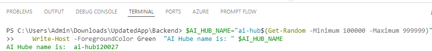
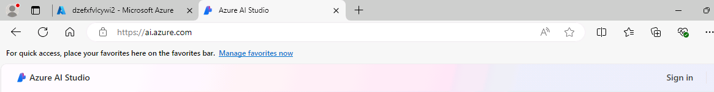
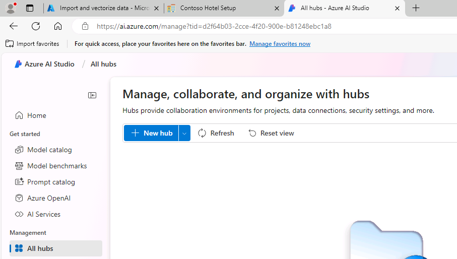
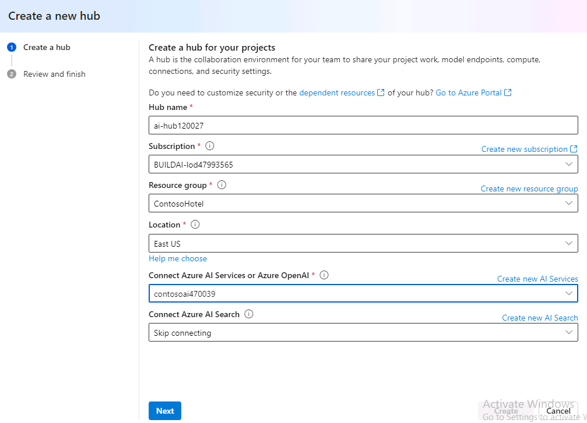
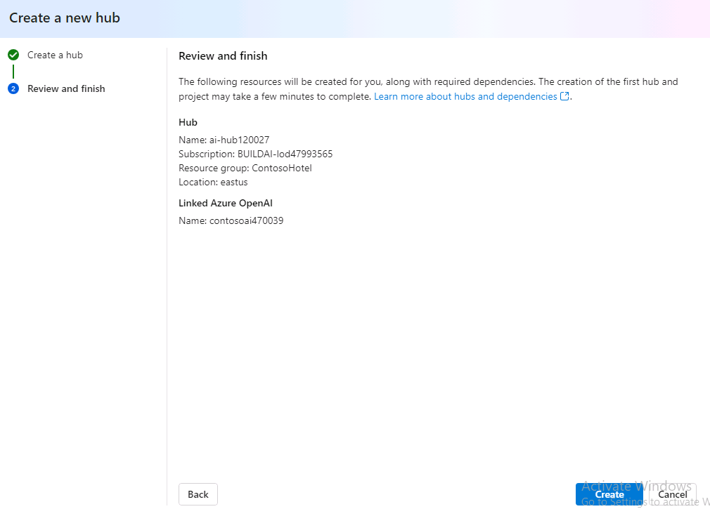
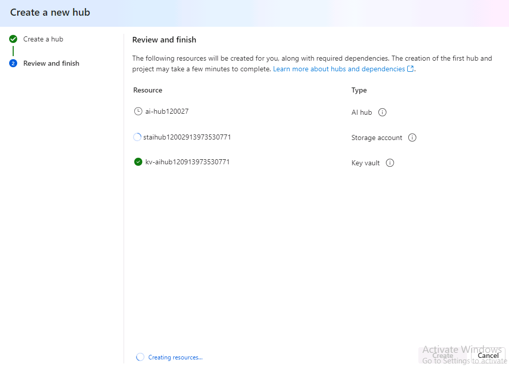
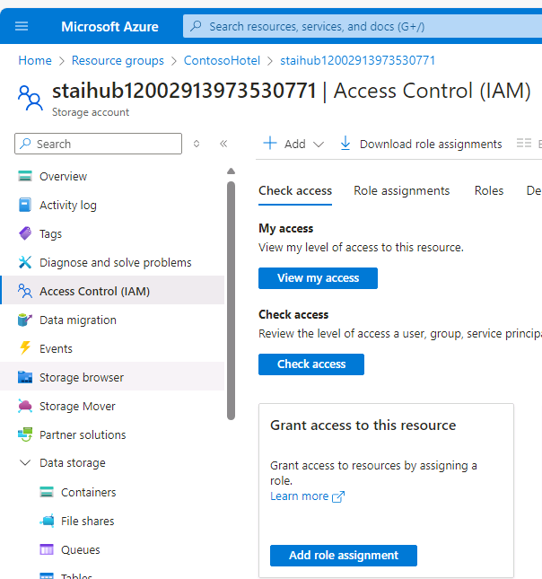
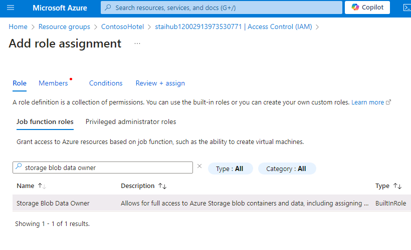
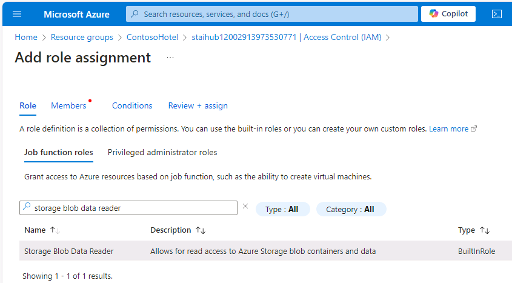
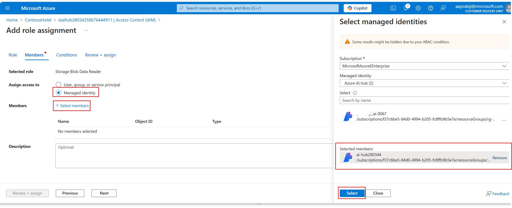

# Task 12 - Create a postgresql user and set up an AI Hub and Prompt Flow

<!--- Estimated time: 20 minutes---> 

## Introduction

Azure AI Studio Hub is a central resource that helps teams manage, collaborate, and organize their AI projects.

## Description

In this task, you’ll create a hub and then create a project within the hub. You’ll also create a PostgreSQL user so that the flow can access the database records.

## Learning Resources

- [**Develop your own custom copilots with Azure AI Studio**](https://learn.microsoft.com/en-us/training/paths/create-custom-copilots-ai-studio/)
- [**Get started with prompt flow**](https://learn.microsoft.com/en-us/training/modules/get-started-prompt-flow-ai-studio/)
- [**Prompt flow in Azure AI Studio**](https://learn.microsoft.com/en-us/azure/ai-studio/how-to/prompt-flow)
- [**Add a new connection in Azure AI Studio**](https://learn.microsoft.com/en-us/azure/ai-studio/how-to/connections-add)

## Solution

1. Return to Visual Studio Code. Enter the following command at the Terminal window prompt. This command creates a unique name for an AI Hub.

    ```
    $AI_HUB_NAME="ai-hub$(Get-Random -Minimum 100000 -Maximum 999999)"
    Write-Host -ForegroundColor Green  "AI Hub name is: " $AI_HUB_NAME

    ```

    

     > 📓 Record the name of the AI Hub. You’ll use the name later in this task.

1. Open a browser window and go to **https://ai.azure.com/**.

1. On the Azure AI Studio home page, select **Sign in**. 

    

1. If prompted, enter your credentials to sign into Azure AI Studio:

1. In the left navigation pane, in the **Management** section, select **All Resources**.

1. On the page that displays, select **+New hub**.

    


1. Configure the hub by using the values in the following table. Leave all other settings at their default values. Wait for the validation to complete and then select **Next**.

    | Setting | Value |
    |:---------|:---------|
    | Hub name   | Use the AI Hub name that you recorded in step 8 of this task.  |
    | Subscription  | Use the subscription where you deployed all other resources.|
    | Resource group | **Ignite24** |
    | Location |Enter the location for the region where you deployed all other resources**|
    | Connect Azure AI Services or OpenAI | Select the name for the OpenAI service instance that you deployed |

    
    
1. On the **Review and finish** page, select **Create**. 

    

1. Wait until the new AI hub, storage account, and key vault are created.

    

     > :warning: As the resources are being provisioned, take a screenshot of the page that displays. You’ll need to enter the AI Hub name and the Storage account name later in this task. Otherwise, you can go to the resource group in Azure portal to see the resource names.

1. Open a browser window and go to [**Azure portal**](https://portal.azure.com).

1. In the **Search** field at the top of the home page, enter **Resource groups** and then select **Ignite24**.

1. Filter the list of resources by using the **Type** column. You should see two storage accounts. The first is the storage account that you created earlier in the lab. The other was created by the AI Hub. Select this storage account.

    > 📓 The name for the newly created storage account will start with **st**. You can also use the screenshot you captured in Step 16 to identify the storage account name to use here.

1. In the left navigation pane for the storage account, select **Access Control (IAM)**.

1. On the **Access Control (IAM)** page, on the **Grant access to this resource** tile, select **Add role assignment**.

    

1. In the **Search** field, enter **Storage Blob Data Owner** and then select **Storage Blob Data Owner** from the list of search results. Select **Next**.

    

1. On the **Add role assignment** page, select **+Select members**.

1. In the **Select members** pane, search for and select your user name.

1. Select **Select** to close the **Select members** pane. Then, select **Review + assign** twice.

1. On the **Access Control (IAM)** page, on the **Grant access to this resource** tile, select **Add role assignment** to add a second role assignment.

1. In the **Search** field, enter **Storage Blob Data Reader** and then select **Storage Blob Data Reader** from the list of search results. Select **Next**.

    

1. In the Members tab select **Managed identity** as the value of the **Assign access to** field 
1. On the **Add role assignment** page, select **+Select members**.
1. In the **Select members** pane, choose your subscription, then choose **Azure AI hub** as the 'Managed identity'. Select the name for the AI Hub that you created in Step 8 of this task.
    

1. Select **Select** to close the **Select members** pane. Then, select **Review + assign** twice.
