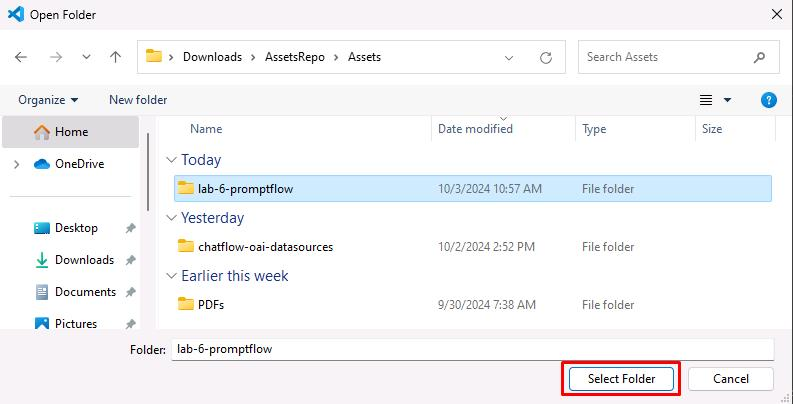
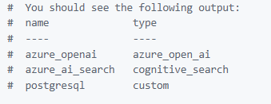
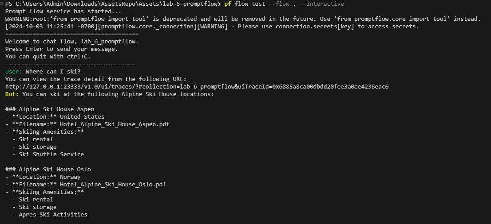
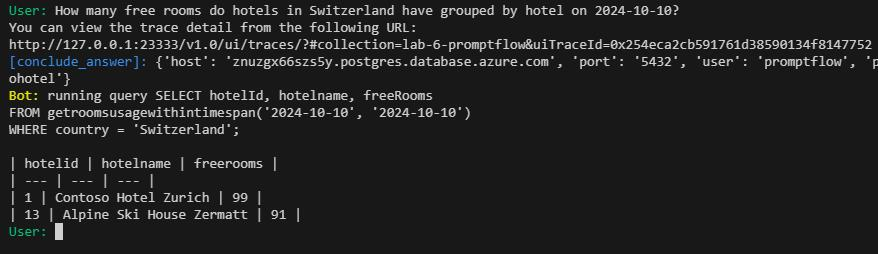

# Task 14 - Set up Visual Studio Code and run the flow locally

## Description

In this task you’ll test the chatbot locally before you publish the chatbot.

## Learning Resources

- [**Deploy a flow using Docker**](https://microsoft.github.io/promptflow/how-to-guides/deploy-a-flow/deploy-using-docker.html)
- [**Prompt flow documentation**](https://microsoft.github.io/promptflow/reference/pf-command-reference.html#pf-flow)

## Solution

1. Launch a new Visual Studio Code window as an administrator.

1. From the menu bar, select **File** and then select **Open Folder**.

1. Navigate into **Downloads/AssetsRepo/Assets**, select **lab-6-promptflow**, and then select **Select folder**.

    

1. Select the option to **Trust the authors**.

1. In the Explorer pane, select the **.env** file to open the file in an Editor window. For the next step, you will need the notes below to get the correct value.

    > 📓 To locate the values for AZURE_OPENAI_ENDPOINT and AZURE_OPENAI_API_KEY, in the Azure portal, select the Azure OpenAI resource you created. In the **Resource Management** section, select **Keys and Endpoints**. Use the Endpoint URL for AZURE_OPENAI_ENDPOINT and the key 1 value for AZURE_OPENAI_API_KEY.

    > 📓 To locate the values for AZURE_AI_SEARCH_ENDPOINT, AZURE_AI_SEARCH_INDEX, and AZURE_AI_SEARCH_API_KEY, in the Azure portal, select the Search Service instance you created.  On the Overview page, use the URL for AZURE_AI_SEARCH_ENDPOINT. In the left hand navigation pane, in the **Search Management** section, select **Indexes**. Use the index name for AZURE_AI_SEARCH_INDEX. In the left navigation pane, in the **Settings** section, select **Keys**. Use Primary admin key for AZURE_AI_SEARCH_API_KEY.
    
    > 📓 For all parameters that start with "PG", use the values from the PostgreSQL connection string that you recorded earlier in the lab.

1. Update the variables marked below you find in the **.env** file  with values you get as described in the notes above as well as parameters you used in previous steps.

    AZURE_OPENAI_ENDPOINT="https://azureopenai62143490.openai.azure.com/" <- needs update
    AZURE_OPENAI_API_KEY="08c96b97791e44ea83c4dff67a76eb32" <- needs update
    AZURE_OPENAI_DEPLOYMENT_ID="gpt-4o"
    AZURE_AI_SEARCH_ENDPOINT="https://contososrch799498.search.windows.net" <- needs update
    AZURE_AI_SEARCH_INDEX="brochures" <- make sure this is "brochures"
    AZURE_AI_SEARCH_API_KEY="ctkSfXrdBMgyYEIFOkECVmrWrdcRioV7wyAfqRVSNGAzSeAsUWls" <- needs update
    PGHOST="mg32xpzwcffkg.postgres.database.azure.com" <- needs update
    PGPORT="5432"
    PGUSER="contosoadmin" <- make sure this is "contosoadmin"
    PGDATABASE="pycontosohotel"
    PGPASSWORD="1234ABcd!"

     > :warning: Make sure the value of PGUSER is "contosoadmin"

1. Save your changes to the **.env** file.

1. Open a new Terminal prompt by selecting **Terminal** from the top menu and then **New Terminal**. Enter the following commands to create environment variables.

    ```
    get-content .env | foreach {
    $name, $value = $_.split('=')
    set-content env:\$name $value
    }
    ```
    
1. Enter the following commands in the Terminal to create a connection to Azure Open AI.

    ```
    # open ai connection
    pf connection create --file azure_openai.yaml --name azure_openai --set "api_base=$env:AZURE_OPENAI_ENDPOINT" --set "api_key=$env:AZURE_OPENAI_API_KEY"
    # ai search connection
    pf connection create --file azure_ai_search.yaml --name azure_ai_search --set "api_base=$env:AZURE_AI_SEARCH_ENDPOINT" --set "api_key=$env:AZURE_AI_SEARCH_API_KEY"
    # postgresql connection
    pf connection create --file postgresql.yaml --name postgresql --set "configs.hostname=$env:PGHOST" --set "configs.port=$env:PGPORT" --set "configs.user=$env:PGUSER" --set "configs.database=$env:PGDATABASE" --set "secrets.passwd=$env:PGPASSWORD"
    ```
    
1. Enter the following command at the Terminal window prompt. This command lists all connections.

    ```
    pf connection list | ConvertFrom-Json | Select-Object name, type |Format-Table
    ```

    

1. At this point, you would want to install the following versions of packages into your python environment, but these have already been installed in your environment.

    ```
    promptflow==1.16.1
    promptflow-tools==1.4.0
    promptflow-azure==1.16.1
    psycopg2-binary==2.9.10
    jinja2==3.1.4
    ```

1. Enter the following commands at the Terminal window prompt. These commands run the flow interactively so that you can perform testing. 

    ```
    pf flow test --flow . --interactive
    ```

1. Enter the question below in the chat terminal manually (the T button might not work here)

    ```
    Where can I ski?
    ```

    

1. Enter the following to query the database

    ```
    How many free rooms do hotels in Switzerland have grouped by hotel on 2024-10-10?
    ```

    
