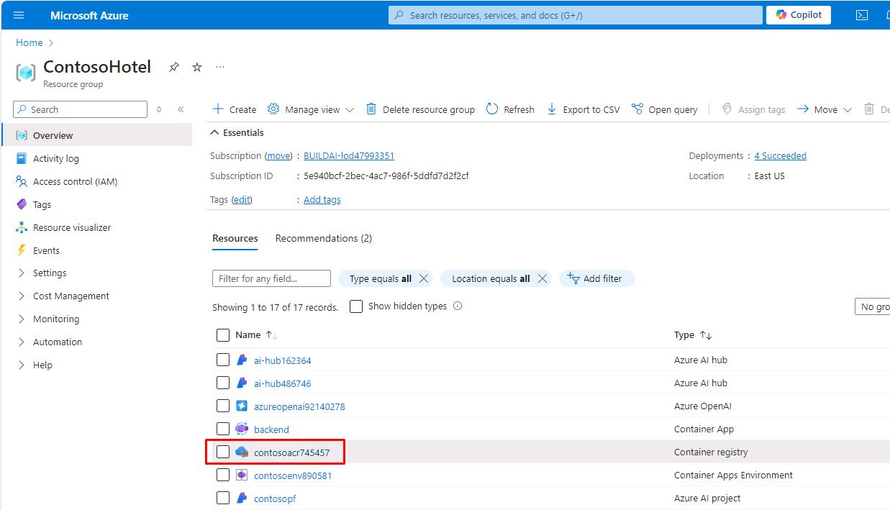
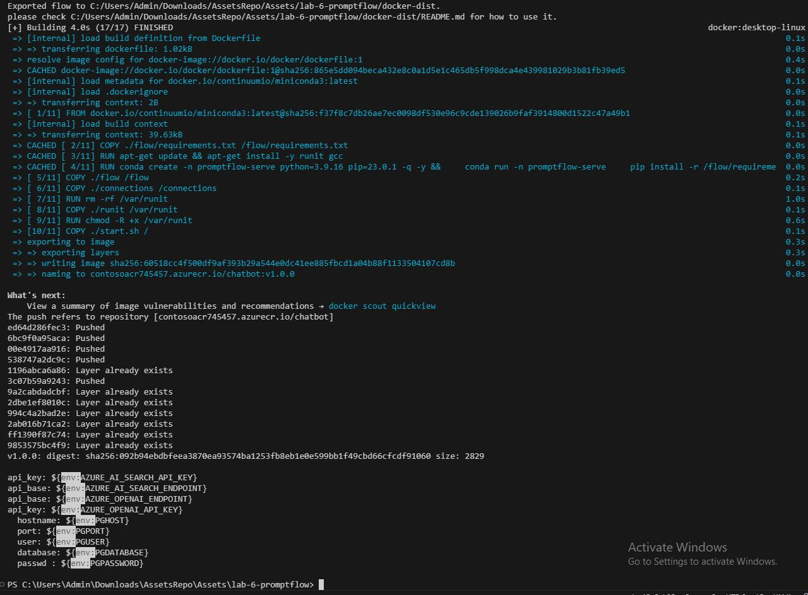
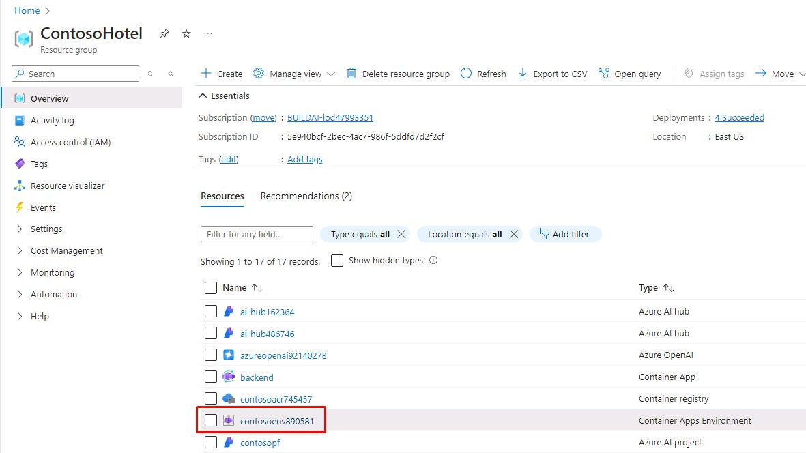
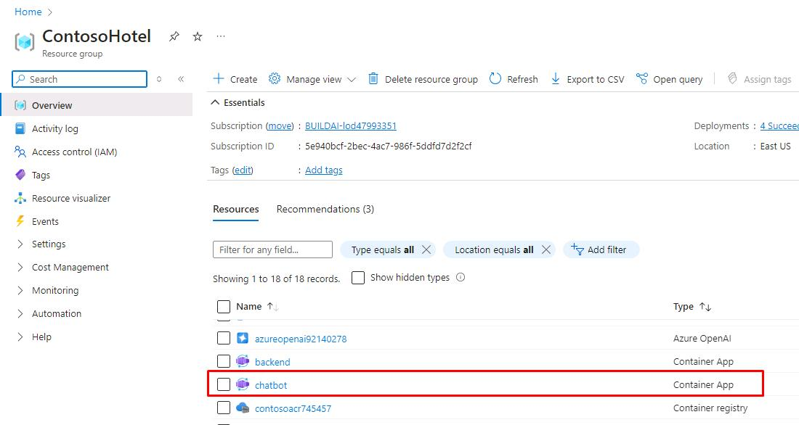
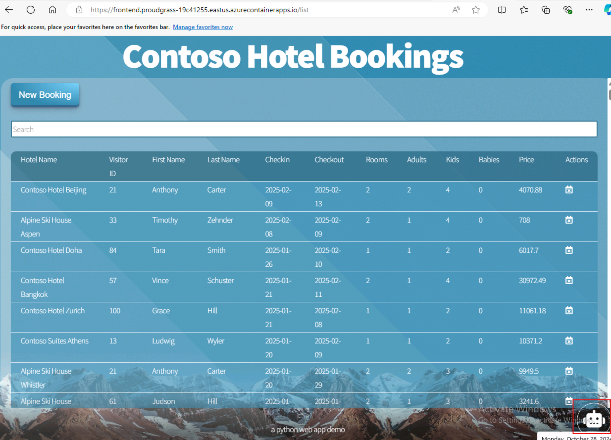
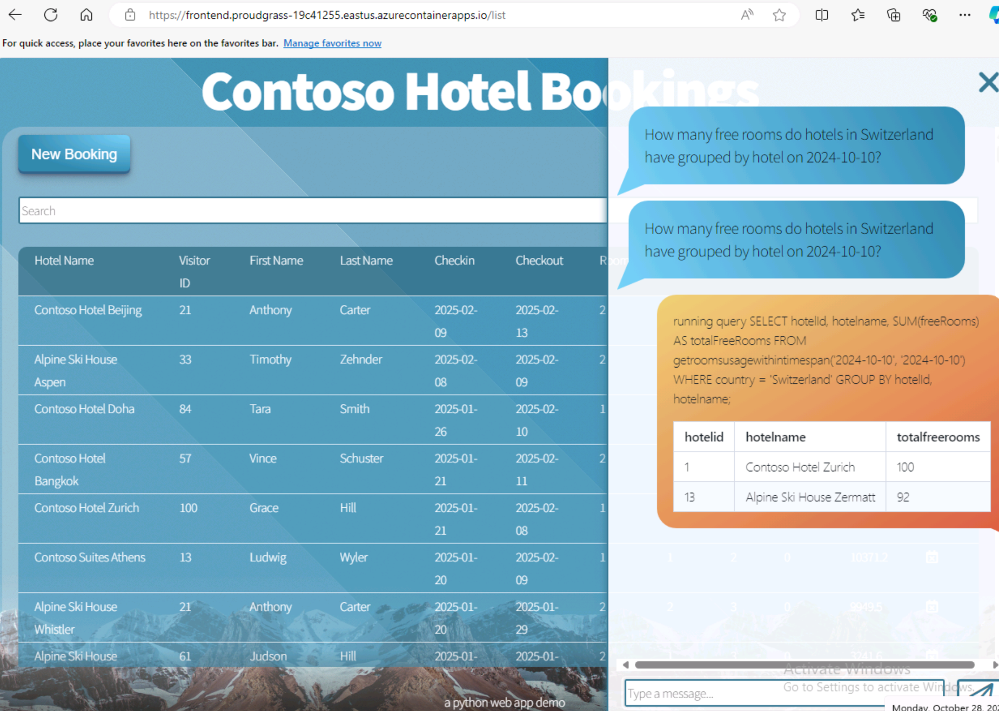

# Task 15 -  Deploy the flow to Azure Container apps and test the app

## Description

In this task you’ll prepare the flow for deployment and deploy the flow. You’ll update the app to display the chatbot page.

## Learning Resources

- [**Deploy a flow using Docker**](https://microsoft.github.io/promptflow/how-to-guides/deploy-a-flow/deploy-using-docker.html)
- [**Promptflow Reference**](https://microsoft.github.io/promptflow/reference/pf-command-reference.html#pf-flow)

## Solution

1. Change the value of **$ACR_NAME** to the Container Registry created in the earlier exercise. If you already have it set, skup to the next step.

    ```
    $ACR_NAME="contosoacr745457"
    ```

     > 📓 If you no longer have it noted down, you can find it again from the **Ignite24** Resource Group.

    

1. Enter the following commands in the Visual Studio Code Terminal window prompt. These commands containerize the flow and push the flow to ACR.

    ```
    # login to acr
    az acr login --name "$ACR_NAME"
    # create flow
    pf flow build --source . --output docker-dist --format docker
    # copy the azure_openai.yaml, azure_ai_search.yaml, and postgresql.yaml into the connections folder
    Copy-Item -Path .\azure_openai.yaml -Destination .\docker-dist\connections -Force
    Copy-Item -Path .\azure_ai_search.yaml -Destination .\docker-dist\connections -Force
    Copy-Item -Path .\postgresql.yaml -Destination .\docker-dist\connections -Force
    # build container
    docker build -t "$ACR_NAME.azurecr.io/chatbot:v1.0.0" ./docker-dist
    # push it to acr
    docker push "$ACR_NAME.azurecr.io/chatbot:v1.0.0"
    # have an overview of defined environment variables
    Get-ChildItem -Path '.\docker-dist\connections' -Filter '*.yaml' | Get-Content | Select-String 'env:'
    # clean up
    Remove-Item -Recurse -Force ./docker-dist
    ```

     > 📓 Prompt flow creates the connection yaml files in the connections folder based on the pf connection command. Ensure that just three connections are defined and the names are azure_openai, azure_ai_search, and postgresql.

    

1. Configure and update the following variables based on your previous configurations and select **Enter**. **$CONTOSO_HOTEL_ENV** will be name of your **Container Apps Environment** found in the **Ignite24** Resource Group. The **_API_KEY**, **_ENDPOINT**, and **PGHOST** variable values can be found in the **.env file** from the last task.

    ```
    $CONTOSO_HOTEL_ENV = "contosoenv890581"
    
    $AZURE_OPENAI_ENDPOINT = "https://azureopenai92140278.openai.azure.com/"
    $AZURE_OPENAI_API_KEY = "d3d089a5cb8d4dc0b7d1adc80e549da7"

    $AZURE_AI_SEARCH_ENDPOINT = "https://contososrch496682.search.windows.net"
    $AZURE_AI_SEARCH_API_KEY = "sUqFKOnX57fUKS0NBeKscezjp5d6ZCY7WVR2AmYOtPAzSeCrtJ0q"

    $PGHOST = "znuzgx66szs5y.postgres.database.azure.com"
    ```

    

1. Enter the following to set the variables for values we've used previously.

    ```
    $RG_NAME = "Ignite24"
    $CONTOSO_ACR_CREDENTIAL = az acr credential show --name $ACR_NAME --query "passwords[0].value" -o tsv

    $PGUSER = "contosoadmin"
    $PGPASSWORD = "1234ABcd!"
    $PGDATABASE = "pycontosohotel"
    $PGPORT = "5432"
    ```

1. Enter the following commands in the Terminal to deploy the container to ACR and set environment variables. 

    ```
    az containerapp create --name "chatbot" --resource-group "$RG_NAME" --environment "$CONTOSO_HOTEL_ENV" `
    --image "$ACR_NAME.azurecr.io/chatbot:v1.0.0" --target-port 8080 --transport http --ingress external `
    --registry-server "$ACR_NAME.azurecr.io" --registry-username "$ACR_NAME" --registry-password "$CONTOSO_ACR_CREDENTIAL" `
    --secrets "searchkey=$AZURE_AI_SEARCH_API_KEY" "openaikey=$AZURE_OPENAI_API_KEY" "pgpassword=$PGPASSWORD" `
    --env-vars "AZURE_AI_SEARCH_ENDPOINT=$AZURE_AI_SEARCH_ENDPOINT" "AZURE_AI_SEARCH_API_KEY=secretref:searchkey" `
    "AZURE_OPENAI_ENDPOINT=$AZURE_OPENAI_ENDPOINT" "AZURE_OPENAI_API_KEY=secretref:openaikey" `
    "PGHOST=$PGHOST" "PGPORT=$PGPORT" "PGUSER=$PGUSER" "PGDATABASE=$PGDATABASE" "PGPASSWORD=secretref:pgpassword"
    $CONTOSO_CHATBOT_URL = "https://$(az containerapp show --name "chatbot" --resource-group "$RG_NAME" --query 'properties.configuration.ingress.fqdn' -o tsv)"
    ```

    ```
    Write-Host -ForegroundColor Green  "Promptflow URL is: $CONTOSO_CHATBOT_URL"
    ```

    
1. OPTIONAL: Enter the URL provided by your last command in a browser and test it with the same questions in the previous exercise.

    ```
    How many free rooms do hotels in Switzerland have grouped by hotel on 2024-10-10?
    ```

1. Enter the following into Visual Studio Code terminal window to pull and set the **$CONTOSO_BACKEND_URL** variable for use in the next step.

    ```
    $CONTOSO_BACKEND_URL = "https://$(az containerapp show --name "backend" --resource-group "Ignite24" --query 'properties.configuration.ingress.fqdn' -o tsv)"
    
    Write-Host -ForegroundColor Green  "Promptflow URL is: $CONTOSO_BACKEND_URL"
    ```

1. Enter the following commands in the Visual Studio Code Terminal window prompt. These commands update the application front-end.

    ```
    az containerapp update --name "frontend" --resource-group "$RG_NAME" --set-env-vars "CHATBOT_BASEURL=$CONTOSO_BACKEND_URL"
    az containerapp update --name "backend" --resource-group "$RG_NAME" --set-env-vars "CHATBOT_BASEURL=$CONTOSO_CHATBOT_URL"
    ```
1. Get the URL of your frontend service
    ```    
    $CONTOSO_FRONTEND_URL = "https://$(az containerapp show --name "frontend" --resource-group "Ignite24" --query 'properties.configuration.ingress.fqdn' -o tsv)"
    
    Write-Host -ForegroundColor Green  "Promptflow URL is: $CONTOSO_FRONTEND_URL"
    ```
1. Copy the frontend URL provided in the last command and paste it in a new browser tab. Click on the calendar sign if it shows. Then click on the robot icon at the bottom right corner of the resulting screen. This will slide out a chat window.
    

1. Go ahead and chat with your new application
    

This concludes this lab. You have successfully broken an monolithic app into Microservices, containerized them, added a new AI feature to it and deployed all services to Azure. Congratulations!